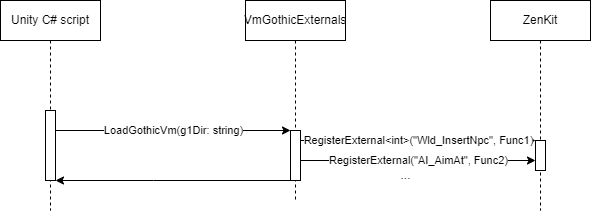
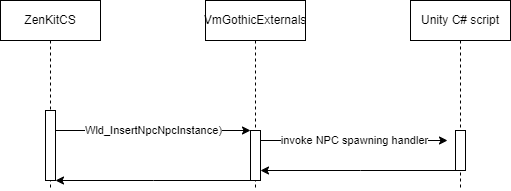

Daedalus External Functions
===

Daedalus is the scripting language used by the Gothic games (more about it in German [here](https://wiki.worldofgothic.de/doku.php?id=daedalus)).

This page is used to keep an overview over the current state of the Daedalus functions' respective implementations. The goal is to implement every single of the following functions.
Current state can be one of the following:
- ${\color{red}TODO}$ (or empty): Feel free to grab and work on it!
- ${\color{orange}In\ Progress}$: Function is being worked on currently; just ask on the Discord if you want to help
- ${\color{green}Done}$: Function is fully implemented and usable

If you work on a function, please update it's status here, so that we don't do duplicate work.

Currently, every Daedalus function is registered in the `VmGothicExternals` and new ones should be added there too. A good starting point for getting an idea on how to implement a specific function is the [OpenGothic](https://github.com/Try/OpenGothic) project's [implementations](https://github.com/Try/OpenGothic/blob/6dfea2c567848ee235ebfa1a8d439c285398e528/game/game/gamescript.h#L223) of them.

If you got any notes, assumed complexity or something else to add, feel free to edit this page and the table below!

# Technical Introduction

This section gives a technical overview for understanding how the external Daedalus functions work in the application's context. It is divided in the initialization and the workflow when the game is running.

When the game is booted, the `GvrBootstrapper.LoadGothicVM(g1Dir: string)` call initializes the ZenKit VM. The call looks as follows:

As can be seen, the `VmGothicExternals` is GothicVR's internal layer for communicating with the ZenKit VM; which handles the execution of the Gothic Daedalus scripts.

The Daedalus scripting language used by Gothic has a list of external functions that can be called from within each script. These can be used e.g. to spawn NPCs, add items to the inventory or handle dialogs.
These functions have to be implemented by us, so that they can interact with our project's code. For this to work, the ZenKit VM is able to register our own implementations for each function that will be executed when being called from a Daedalus script.
In the above diagram you can see that the `VmGothicExternals` registers each single function with the `RegisterExternal<>("", ...)` method.

When executing the Daedalus scripts, the ZenKit VM will then look up which of our functions is registered for the specific one being called. It will then execute our registered function and pass the `vmPtr` object which can be used to retrieve the function's parameters. The process is being described in the following diagram:

The above call will be executed when the invocation of an external function is found in a Daedalus script while evaluating it in the ZenKit VM.

> *Note*: When no Daedalus function with the same name is explicitly registered, the default handler `DefaultExternal` is called which currently logs the function's name so that missing functions can be easily identified in the game's logs.

# List of all External Daedalus Functions

All functions have been shamelessly copied from [World of Gothic](https://www.worldofgothic.de/modifikation/article_371.htm).

Jump to section:
- [AI](#ai-functions)
- [Apply Options](#apply-options-functions)
- [Doc](#doc-functions)
- [Helper](#helper-functions)
- [Info](#info-functions)
- [Log](#log-functions)
- [Model](#model-functions)
- [Mission](#mission-functions)
- [Mob](#mob-functions)
- [NPC](#npc-functions)
- [Print](#print-functions)
- [Sound](#sound-functions)
- [Day Routine](#day-routine-functions)
- [World](#world-functions)
- [Misc](#misc-functions)

## AI Functions

| Function Name | Original Description | Function Parameter | Current State | Assumed Complexity | Unity Implementation Idea |
|---|---|---|---|---|---|
| AI_AimAt | NPC zielt mit Fernkampfwaffe auf Target-NPC | void AI_AimAt(var c_npc attacker, var c_npc target) |  |  |  |
| AI_AlignToFP | richtet den Nsc am Freepoint aus (im Spacer gesetzte Pfeilrichtung) | void AI_AlignToFP(var c_npc self) |  |  |  |
| AI_AlignToWP | richtet den Nsc am Waypoint aus (im Spacer gesetzte Pfeilrichtung) | void AI_AlignToWP(var c_npc self) |  |  |  |
| AI_Ask | die angegeben Instanz (self), gibt eine Frage aus und verweist auf die selbst zu definierenden Funktionen, die für die Fälle Spieler sagt ja (Daumen nach oben) und Spieler sagt nein (Daumen unten) vorhanden sein müssen | void AI_Ask(var c_npc self, var func anseryes, var func answerno) |  |  |  |
| AI_AskText | wie AI_Ask, nur das außer den Funktionen auch noch Strings für die Antworten Ja/Nein mit angegeben werden können | void AI_AskText(var c_npc self, var func funcyes, var func funcno, var string stryes, var string strno) |  |  |  |
| AI_Attack | Startet Kampf AI (sollte in der ZS_Attack-Loop stehen) Es wird das interne Ziel verwendet, das mit Npc_SetTarget() oder Npc_GetNextTarget() gesetzt wurde. | void AI_Attack(var c_npc self) |  |  |  |
| AI_CanSeeNpc | Noch nicht dokumentiert | void AI_CanSeeNpc(var instance n0, var instance n1, var func f2) |  |  |  |
| AI_CombatReactToDamage | Noch nicht dokumentiert | void AI_CombatReactToDamage(var instance n0) |  |  |  |
| AI_ContinueRoutine | Setze Tagesablauf fort Enthält Standup | void AI_ContinueRoutine(var c_npc self) |  |  |  |
| AI_Defend | Der Befehl ist als Overlay-Message implementiert. Das heisst, dass er neben anderen Nachrichten aktiv bleibt. Er wird erst beendet, wenn der NPC eine Parade (ausgeloest durch die Attacke eines anderen NPCs) durchgefuert hat. | void AI_Defend(var c_npc self) |  |  |  |
| AI_Dodge | Der Nsc weicht ein Stück nach hinten aus | void AI_Dodge(var c_npc npc) |  |  |  |
| AI_DrawWeapon | Equipte Waffe wird gezogen | void AI_DrawWeapon(var c_npc n0) |  |  |  |
| AI_DropItem | Item(itemid) wird auf den Boden fallen gelassen | void AI_DropItem(var c_npc self, var int itemid) |  |  |  |
| AI_DropMob | Noch nicht dokumentiert | void AI_DropMob(var instance n0) |  |  |  |
| AI_EquipArmor | Ziehe die angebene Rüstung dem NSC "owner" an, diese muss sich in seinem Inventory befinden. | void AI_EquipArmor(var c_npc owner, var c_item armor_from_owners_inventory) |  |  |  |
| AI_EquipBestArmor | Wunder, Wunder hier wird die beste im Inventory vorhandene Rüstung angezogen | void AI_EquipBestArmor(var c_npc self) |  |  |  |
| AI_EquipBestMeleeWeapon | sucht im Inventory nach der besten Nahkampfwaffe und hängt sie an den Gürtel | void AI_EquipBestMeleeWeapon(var c_npc self) |  |  |  |
| AI_EquipBestRangedWeapon | sucht im Inventory nach der besten Fernkampfwaffe und ploppt sie auf den Rücken der Instanz | void AI_EquipBestRangedWeapon(var c_npc self) |  |  |  |
| AI_FinishingMove | Führt den logischen Finishing Move inklusive Anis aus den Skripten heraus aus | void AI_FinishingMove(var c_npc self, var c_npc other) |  |  |  |
| AI_Flee | Der Befehl muss, wie AI_Attack(), in der ZS-Loop regelmaessig aufgerufen werden und setzt voraus, dass vorher mit Npc_SetTarget( self, ) ein Gegner gesetzt wurde, vor dem der Npc fliehen soll. | void AI_Flee(var c_npc self) |  |  |  |
| AI_GotoFP | Sucht sich einen Freepoint im Umkreis von 20m vom NSC, bewegt sich dorthin und richtet sich entsprechend aus. Suchkriterium wie bei Wld_IsFPAvailable() | void AI_GotoFP(var c_npc self, var string fpname) |  |  |  |
| AI_GotoItem | "self" geht zu "item" | void AI_GotoItem(var c_npc self, var c_item item) |  |  |  |
| AI_GotoNextFP | wie AI_GotoFP() allerdings Suchkriterium wie bei Wld_IsNextFPAvailable() | void AI_GotoNextFP(var c_npc self, var string fpname) |  |  |  |
| AI_GotoNpc | "self" geht zu "other" | void AI_GotoNpc(var c_npc self, var c_npc other) |  |  |  |
| AI_GotoSound | Npc läuft zum Sound | void AI_GotoSound(var c_npc n0) |  |  |  |
| AI_GotoWP | Npc-Instanz läuft zum namentlich angegeben Waypoint | void AI_GotoWP(var c_npc n0, var string s0) |  |  |  |
| AI_LookAt | Schaue auf einen Wegpunkt (Wegpunktname angeben) oder auf ein anderes Objekt (Vobname angeben) | void AI_LookAt(var c_npc self, var string name) |  |  |  |
| AI_LookAtNpc | Schaue zu einem NSC | void AI_LookAtNpc(var c_npc self, var c_npc other) |  |  |  |
| AI_LookForItem | gibt die Möglichkeit nach bestimmten Items zu suchen (z.B.:Das goldene Schwert der Zerstörung, wenn vorhanden) | void AI_LookForItem(var c_npc self, var int instance) |  |  |  |
| AI_Output | Cutscene mit entsprechender Id wird abgenudelt | void AI_Output(var c_npc self, var c_npc target, var string outputname) |  |  |  |
| AI_OutputSVM | Outputbefehl um Svms abzuspielen | void AI_OutputSVM(var c_npc self, var c_npc target, var string svmname) |  |  |  |
| AI_OutputSVM_Overlay | wie AI_OutputSVM, wartet jedoch NICHT mit der Ausführung des nächsten AI_...-Befehls, bis das SVM zuende gespielt wird. (Für Kommentare kurz vor und während dem Kampf!) | void AI_OutputSVM_Overlay(var c_npc self, var c_npc target, var string svmname) |  |  |  |
| AI_PlayAni | Npc-Instanz spielt die angegebene Animation ab | void AI_PlayAni(var c_npc n0, var string s0) |  |  |  |
| AI_PlayAniBS | Beim Abspielen einer Ani mit diesem Befehl kann ein Bodystate angemeldet werden | void AI_PlayAniBS(var c_npc npc, var string aniname, var int bodystate) |  |  |  |
| AI_PlayCutscene | Eine Cutscene aus den Scripten heraus starten | void AI_PlayCutscene(var c_npc self, var string csname) |  |  |  |
| AI_PointAt | Zeige auf einen Wegpunkt (Wegpunktname angeben) oder auf ein anderes Objekt (Vobname angeben) | void AI_PointAt(var c_npc self, var string name) |  |  |  |
| AI_PointAtNpc | Zeige auf einen NSC | void AI_PointAtNpc(var c_npc self, var c_npc other) |  |  |  |
| AI_ProcessInfos | Noch nicht dokumentiert | void AI_ProcessInfos(var instance n0) |  |  |  |
| AI_QuickLook | Noch nicht dokumentiert | void AI_QuickLook(var instance n0, var instance n1) |  |  |  |
| AI_Quicklook | NSC kurz ( 2 sec) anschauen ( nur Kopf bewegt sich ) | void AI_Quicklook(var c_npc self, var c_npc other) |  |  |  |
| AI_ReadyMeleeWeapon | Ziehe equippte Nahkampfwaffe | void AI_ReadyMeleeWeapon(var c_npc self) |  |  |  |
| AI_ReadyRangedWeapon | Ziehe equippte Fernkampfwaffe | void AI_ReadyRangedWeapon(var c_npc self) |  |  |  |
| AI_ReadySpell | Lasse zauberspruch auf Hand erscheinen. | void AI_ReadySpell(var c_npc self, var int spellid, var int investmana) |  |  |  |
| AI_RemoveWeapon | Gezogene Waffe wird weggesteckt | void AI_RemoveWeapon(var c_npc n0) |  |  |  |
| AI_SetNpcsToState | Setze alle NSCs im Umkreis von x cm in entsprechenden AI-Zustand VORSICHT: Diese Funktion ist Buggy, wird aber derzeit auch NICHT verwendet! -> FINGER WEG!!! (SN) | void AI_SetNpcsToState(var c_npc self, var func aistatefunc, var int radius) |  |  |  |
| AI_SetWalkMode | Noch nicht dokumentiert | void AI_SetWalkMode(var instance n0, var int i1) |  |  |  |
| AI_SetWalkmode | gibt an mit welchem Walkmode Run etc der Character durch das Level läuft NPC_RUN : Rennen NPC_WALK : Gehen NPC_SNEAK : Schleichen NPC_RUN_WEAPON : Rennen mit gezogener Waffe NPC_WALK_WEAPON : Gehen mit gezogener Waffe NPC_SNEAK_WEAPON : Schleichen mit gezogener Waffe | void AI_SetWalkmode(var c_npc n, var int n0) |  |  |  |
| AI_ShootAt | NPC feuert mit Fernkampfwaffe auf Target-NPC | void AI_ShootAt(var c_npc attacker, var c_npc target) |  |  |  |
| AI_StandUp | - Ist der Nsc in einem Animatinsstate, wird die passende Rücktransition abgespielt. - Benutzt der NSC gerade ein MOBSI, poppt er ins stehen. | void AI_StandUp(var c_npc self) |  |  |  |
| AI_StandUpQuick | Wie AI_StandUp(), jedoch werden keine Rücktransitionen abgespielt, sondern auch dort wird sofort in den Grundzustand "gepoppt". Wichtig für sehr eilige Situationen! | void AI_StandUpQuick(var c_npc self) |  |  |  |
| AI_StartState | Versetzt den Nsc aus den Skripten heraus in den entsprechenden ZS (what), stateBehaviour sagt : "0"-aktuellen Zustand abbrechen "1"-aktuellen Zustand erst ordnungsgemäß beenden (End-Funktion aufrufen) ). | void AI_StartState(var c_npc self, var func what, var int statebehaviour, var string wpname) |  |  |  |
| AI_StopAim | NPC beendet vorher gestartetes Zielen mit Fernkampfwaffe. | void AI_StopAim(var c_npc attacker) |  |  |  |
| AI_StopLookAt | wieder geradeaus schauen | void AI_StopLookAt(var c_npc self) |  |  |  |
| AI_StopPointAt | nicht mehr auf etwas zeigen | void AI_StopPointAt(var c_npc self) |  |  |  |
| AI_StopProcessInfos | Der DialogModus wird beendet (Multiple Choice-Dialog) | void AI_StopProcessInfos(var c_npc npc) |  |  |  |
| AI_TakeItem | der Npc nimmt mit dieser Funktion die globale Item-Instanz auf | void AI_TakeItem(var c_npc self, var c_item item) |  |  |  |
| AI_TakeMob | Noch nicht dokumentiert | void AI_TakeMob(var instance n0, var string s1) |  |  |  |
| AI_Teleport | teleportiert den NSC zur angegebenene Location | void AI_Teleport(var c_npc self, var string waypoint) |  |  |  |
| AI_TurnAway | Der NSC "self" dreht dem NSC "other" den Rücken zu. | void AI_TurnAway(var c_npc n0, var c_npc n1) |  |  |  |
| AI_TurnToNpc | drehe Dich zum angegeben (zweiten) Npc um | void AI_TurnToNpc(var c_npc n0, var c_npc n1) |  |  |  |
| AI_TurnToSound | Charakter dreht sich zur Geräuschquelle | void AI_TurnToSound(var c_npc self) |  |  |  |
| AI_UnequipArmor | Unequippe aktuelle Rüstung | void AI_UnequipArmor(var c_npc self) |  |  |  |
| AI_UnequipWeapons | Unequippe alle Waffen | void AI_UnequipWeapons(var c_npc self) |  |  |  |
| AI_UnreadySpell | lasse zauberspruch aus Hand verschwinden | void AI_UnreadySpell(var c_npc self) |  |  |  |
| AI_UseItem | Item bis zum Ende benutzen | void AI_UseItem(var c_npc self, var int iteminstance) |  |  |  |
| AI_UseItemToState | Item benutzen bis zum angegebenen State | void AI_UseItemToState(var c_npc self, var int iteminstance, var int state) |  |  |  |
| AI_UseMob | Benutze Mob mit angegebenen Schema-Namen bis zum Zustand "targetState". Wird diese Funktion aufgerufen und der angegebene 'targetState' ist bereits vorhanden, läuft der NSC zwar trotzdem zum MOB, tut dann aber nichts | int AI_UseMob(var c_npc self, var string schemename, var int targetstate) |  |  |  |
| AI_Wait | Character wird für n1 Sekunden in einen Wait-Zustand versetzt, d.h. er tut nichts, aber Treffer etc.(passive Wahrnehmung) werden registriert | void AI_Wait(var c_npc n0, var float n1) |  |  |  |
| AI_WaitForQuestion | NSC wartet 20 Sekunden, wird er in dieser Zeit vom Spieler angesprochen, wird die angegebene SkriptFunktion ausgeführt. | void AI_WaitForQuestion(var c_npc self, var func scriptfunc) |  |  |  |
| AI_WaitMS | Noch nicht dokumentiert | void AI_WaitMS(var instance n0, var int i1) |  |  |  |
| AI_WaitTillEnd | 'self' wartet bis 'other' seinen laufenden AI-Befehl zu Ende gespielt hat (funzt allerdings nicht bei AI-Overlays!) | void AI_WaitTillEnd(var c_npc self, var c_npc other) |  |  |  |
| AI_WhirlAround | schnelle Drehung zu other | void AI_WhirlAround(var c_npc self, var c_npc other) |  |  |  |
| AI_WhirlAroundToSource | Noch nicht dokumentiert | void AI_WhirlAroundToSource(var instance n0) |  |  |  |

## Apply Options Functions

| Function Name | Original Description | Function Parameter | Current State | Assumed Complexity | Unity Implementation Idea |
|---|---|---|---|---|---|
| Apply_Options_Audio | Noch nicht dokumentiert | void Apply_Options_Audio() |  |  |  |
| Apply_Options_Controls | Noch nicht dokumentiert | void Apply_Options_Controls() |  |  |  |
| Apply_Options_Game | Noch nicht dokumentiert | void Apply_Options_Game() |  |  |  |
| Apply_Options_Performance | Noch nicht dokumentiert | void Apply_Options_Performance() |  |  |  |
| Apply_Options_Video | Noch nicht dokumentiert | void Apply_Options_Video() |  |  |  |

## Doc Functions

| Function Name | Original Description | Function Parameter | Current State | Assumed Complexity | Unity Implementation Idea |
|---|---|---|---|---|---|
| Doc_Create | erstellet ein Dokument und liefert ein Handle zurück, daß für alle weiteren Doc_...-Befehle nötig ist | int Doc_Create() |  |  |  |
| Doc_CreateMap | Noch nicht dokumentiert | int Doc_CreateMap() |  |  |  |
| Doc_Font | Benutzt den angegebenen Font für nachfolgende "Doc_Print"s. | void Doc_Font(var string fontname) |  |  |  |
| Doc_MapCoordinates | Karte initialisieren : levelName = Name des Levels (.ZEN) aus dem die Karte einen Ausschnitt zeigt gamex1,gamey1 : Koordinaten im Spiel (linke obere Ecke der Karte) pixelx1,pixely1 : PixelKoordinaten linke obere Ecke // der Rest : alles nochmal für die rechte untere Ecke | void Doc_MapCoordinates(var string levelname, var float gamex1, var float gamey1, var float pixelx1, var float pixely1, var float gamex2, var float gamey2, var float pixelx2, var float pixely2) |  |  |  |
| Doc_Open | Öffnet ein Dokument mit dem Bild "picName" als Hintergrund | void Doc_Open(var string picname) |  |  |  |
| Doc_Print | Angegebener Text wird in das aktuelle (vorher mit Doc_Open geöffnete) Dokument geschrieben | void Doc_Print(var string text) |  |  |  |
| Doc_PrintLine | Gibt Text für die Seite 'page' an. Der Text wird NICHT umgebrochen | void Doc_PrintLine(var int handle, var int page, var string text) |  |  |  |
| Doc_PrintLines | Gibt Text für die Seite 'page' an. Der Text WIRD umgebrochen, falls er nicht auf die in Doc_SetPage() angegebene Grafik passt. | void Doc_PrintLines(var int handle, var int page, var string text) |  |  |  |
| Doc_SetFont | setzt den Font für die angegebene Seite 'page' oder für das ganze Dokument ('page':-1) Fontname z.B. "Scrolls.tga" | void Doc_SetFont(var int handle, var int page, var string fontname) |  |  |  |
| Doc_SetLevel | Noch nicht dokumentiert | void Doc_SetLevel(var int i0, var string s1) |  |  |  |
| Doc_SetMargins | setzt die Ränder (gerechnet vom Rand der TGA-Datei, die in Doc_SetPage() gesetzt wird). Die Ränder sind in Pixeln angegeben. | void Doc_SetMargins(var int handle, var int page, var int leftmargin, var int topmargin, var int rightmargin, var int bottommargin, 1?) |  |  |  |
| Doc_SetPage | setzt für die Seite 'page' die Grafik-Datei 'pageimage'. Diese muß im TGA-Format vorliegen und z.B. "aufgeschlagenesBuch_links.tga" heißen wird bei 'page' -1 übergeben, so bezieht sich der Befehl auf ALLE Seiten des Dokuments | void Doc_SetPage(var int handle, var int page, var string pageimage , 0?) |  |  |  |
| Doc_SetPages | setzt die Anzahl der Seiten dieses Dokuments. Bei mehr als zwei Seiten wird versucht ALLE Seiten auf den Bildschrim zu bekommen | void Doc_SetPages(var int handle, var int pages) |  |  |  |
| Doc_Show |  | void Doc_Show(var int handle) |  |  |  |

## Helper Functions

| Function Name | Original Description | Function Parameter | Current State | Assumed Complexity | Unity Implementation Idea |
|---|---|---|---|---|---|
| Hlp_CutscenePlayed | Abfrage, ob Cutscene schon gespielt wurde (0 = Nein / 1 = Ja) | int Hlp_CutscenePlayed(var string csname) |  |  |  |
| Hlp_GetInstanceID | liefert die interne ID ( nicht Var aus der Instanz) zurück, um zwei items miteinander vergleichen zu können ( integer Vergleich) | int Hlp_GetInstanceID(var c_item item) |  |  |  |
| Hlp_GetNpc | Ermittle einen NSC über den Instanznamen. Dieser kann einer Variablen zugewiesen werden und ist somit gezielt verfügbar | c_npc Hlp_GetNpc(var int instancename) |  |  |  |
| Hlp_IsItem | Prüft, ob der Gegenstand 'item' den Instanznamen 'instanceName' trägt. Will man z.B. testen, ob die globale Variable item Pfeile sind (ItMuArrow) ruft man Hlp_IsItem(item,ItMuArrow) auf. Gribt bei Gleichheit TRUE, sonst FALSE zurück. | int Hlp_IsItem(var c_item item, var int instancename) |  |  |  |
| Hlp_IsValidItem | Prüfe ob Item-Instanz gültig und initialisiert ist True/False | int Hlp_IsValidItem(var c_item item) |  |  |  |
| Hlp_IsValidNpc | Prüfe ob NSC-Instanz gültig und initialisiert ist. True/False | int Hlp_IsValidNpc(var c_npc self) |  |  |  |
| Hlp_Random | erzeugt einen Zufallswert (wobei n0 Obergrenze : [0..n0-1] ) Rückgabewert integer | int Hlp_Random(var int n0) |  |  |  |
| Hlp_StrCmp | Hilfsfunktion um zwei Strings miteinander zu vergleichen liefert bei Gleichheit eins zurück | int Hlp_StrCmp(var string s1, var string s2) |  |  |  |

## Info Functions

| Function Name | Original Description | Function Parameter | Current State | Assumed Complexity | Unity Implementation Idea |
|---|---|---|---|---|---|
| InfoManager_HasFinished | Noch nicht dokumentiert | int InfoManager_HasFinished() |  |  |  |
| Info_AddChoice | Noch nicht dokumentiert | void Info_AddChoice(var int i0, var string s1, var func f2) |  |  |  |
| Info_ClearChoices | Noch nicht dokumentiert | void Info_ClearChoices(var int i0) |  |  |  |

## Log Functions

| Function Name | Original Description | Function Parameter | Current State | Assumed Complexity | Unity Implementation Idea |
|---|---|---|---|---|---|
| Log_AddEntry | Der Befehl fügt dem Topics topic ein neues Entrz namens entry hinzu. Wie auch bei der Erzeugung von Topics dient hier der Name sowohl zur Identifikation als auch zur Anzeige und muss somit eindeutig sein. Doppelte Einträge werden auch hier ignoriert.  Parameter topic Diejenige Zeichenkette, die bei der Erstellung des Topics per Log_CreateTopic() angegeben wurde. entry Eine eindeutige Zeichenkette, die sowohl zur Identifikation als auch zur Anzeige des Eintrags verwendet wird. | void Log_AddEntry(var string topic, var string entry) |  |  |  |
| Log_CreateTopic | Der Befehl fügt unter der Sektion 'section' ein neues Topic mit Namen 'name' ein. Sollte bereits ein Topic dieses Names in irgendeiner Sektion existieren, wird das Topic nicht hinzugefügt.  Parameter: - name Eine eindeutige Zeichenkette, die sowohl zur Identifikation als auch zur Anzeige des Topics verwendet wird. - section Eine, in der Constants.d definierte Konstante, die besagt, in welcher Sektion das Topic angezeigt werden soll. Die Konstante kann folgende Werte annehmen: - LOG_MISSION - LOG_NOTE | void Log_CreateTopic(var string name, var int section) |  |  |  |
| Log_SetTopicStatus | Der Befehl ändert den Status des Topics 'name' in 'status'. Er sollte nur für Topics verwendet werden, die für die Sektion LOG_MISSION erzeugt wurden.  Parameter: - name Diejenige Zeichenkette, die bei der Erstellung des Topics per Log_CreateTopic() angegeben wurde. - status Eine, in der Constants.d definierte Konstante, die besagt, unter welchem Status die Mission dargestellt werden soll. Folgende Werte sind möglich: - LOG_RUNNING - LOG_SUCCESS - LOG_FAILED - LOG_OBSOLETE | void Log_SetTopicStatus(var string name, var int status) |  |  |  |

## Model Functions

| Function Name | Original Description | Function Parameter | Current State | Assumed Complexity | Unity Implementation Idea |
|---|---|---|---|---|---|
| Mdl_ApplyOverlayMDS | Noch nicht dokumentiert | void Mdl_ApplyOverlayMDS(var instance n0, var string s1) |  |  |  |
| Mdl_ApplyOverlayMDSTimed | Overlay-MDS wird gestartet und automatisch nach der angegebenen Zeit abgeschaltet | void Mdl_ApplyOverlayMDSTimed(var c_npc self, var string overlayname, var float timeticks) |  |  |  |
| Mdl_ApplyOverlayMds | mit diesem Befehl werden Animationen auf einem höheren Layer gestartet (z.B. hat der Zombie ein Overlay über die normalen Human-Animationen) | void Mdl_ApplyOverlayMds(var c_npc n0, var string s1) |  |  |  |
| Mdl_ApplyOverlayMdsTimed | Noch nicht dokumentiert | void Mdl_ApplyOverlayMdsTimed(var instance n0, var string s1, var int i2) | $${\color{orange}In\ Progress}$$ |  |  |
| Mdl_ApplyRandomAni | Fügt Zufallsanimationen (am Kopf kratzen, an den Sack packen etc (s2)) für bestimmte Animationszustände (s1) ein | void Mdl_ApplyRandomAni(var c_npc n0, var string s1, var string s2) |  |  |  |
| Mdl_ApplyRandomAniFreq | hiermit kann die Frequenz betimmt werden, wie oft die für den Animationszustand (s1) deklarierten Randomanis abgespielt werden | void Mdl_ApplyRandomAniFreq(var c_npc n0, var string s1, var float f2) |  |  |  |
| Mdl_ApplyRandomFaceAni | Starte zufällige Gesichtsanimation Mdl_ApplyRandomFaceAni ( self, ANINAME, minTime, minTimeVar, maxTime, maxTimeVar, probMin) minTime = Minimum an Zeit nachdem Ani startet (in Sekunden) maxTime = Maximum an Zeit nachdem Ani startet (in Sekunden) minTimeVar = Abweichung von minTime (in Sekunden) maxTimeVar = Abweichung von maxTime (in Sekunden) probMin = Wahrscheinlichkeit [0..1] ob obere oder untere Grenze der Abweichung benutzt wird | void Mdl_ApplyRandomFaceAni(var c_npc self, var string name, var float timemin, var float timeminvar, var float timemax, var float timemaxvar, var float probmin) |  |  |  |
| Mdl_RemoveOverlayMDS | Entferne ein Overlay-MDS | void Mdl_RemoveOverlayMDS(var c_npc self, var string overlayname) |  |  |  |
| Mdl_SetModelFatness | Setzt Model-Z-Skalierung | void Mdl_SetModelFatness(var c_npc self, var float fatness) |  |  |  |
| Mdl_SetModelScale | zum skalieren des Meshes (Breite,Höhe,Tiefe) 1 = 100%, also Normalgröße! | void Mdl_SetModelScale(var c_npc self, var float x, var float y, var float z) |  |  |  |
| Mdl_SetVisual | Noch nicht dokumentiert | void Mdl_SetVisual(var instance n0, var string s1) | $${\color{orange}In\ Progress}$$ |  |  |
| Mdl_SetVisualBody | Noch nicht dokumentiert | void Mdl_SetVisualBody(var instance n0, var string s1, var int i2, var int i3, var string s4, var int i5, var int i6, var int i7) | $${\color{orange}In\ Progress}$$ |  |  |
| Mdl_StartFaceAni | Starte Gesichtsanimation // intensity 1 = 100% // holdTime -1 = forever | void Mdl_StartFaceAni(var c_npc self, var string name, var float intensity, var float holdtime) |  |  |  |

## Mission Functions

| Function Name | Original Description | Function Parameter | Current State | Assumed Complexity | Unity Implementation Idea |
|---|---|---|---|---|---|
| Mis_AddMissionEntry | Noch nicht dokumentiert | void Mis_AddMissionEntry(var instance n0, var string s1) |  |  |  |
| Mis_GetStatus | Liefert aktuellen Status einer Mission zurück ( Bezogen auf den Spieler ) -> RUNNING, SUCCESS, FAILED etc. | int Mis_GetStatus(var int missionname) |  |  |  |
| Mis_OnTime | Liefert TRUE, wenn sich Spieler noch innerhalb des Zeitlimits für diese Mission befindet | int Mis_OnTime(var int missionname) |  |  |  |
| Mis_RemoveMission | Noch nicht dokumentiert | void Mis_RemoveMission(var instance n0) |  |  |  |
| Mis_SetStatus | Setzt den Status einer Mission ( Bezogen auf den Spieler ) -> RUNNING, SUCCESS, FAILED etc. ) | void Mis_SetStatus(var int missionname, var int newstatus) |  |  |  |

## Mob Functions

| Function Name | Original Description | Function Parameter | Current State | Assumed Complexity | Unity Implementation Idea |
|---|---|---|---|---|---|
| Mob_CreateItems | Erzeuge "amount" Items der Instanz "itemInstance" in oCMobContainer mit angegebenen Vobnamen. | void Mob_CreateItems(var string mobname, var int iteminstance, var int amount) |  |  |  |
| Mob_HasItems | Liefere Anzahl der Items der Instanz "itemInstance" in oCMobContainer mit angegebenen Vobnamen | int Mob_HasItems(var string mobname, var int iteminstance) |  |  |  |

## NPC Functions

| Function Name | Original Description | Function Parameter | Current State | Assumed Complexity | Unity Implementation Idea |
|---|---|---|---|---|---|
| NPC_GiveInfo | Überprüft,ob der NSC eine (!) gültige Info für den Spieler hat und startet diese gegebenenfalls (Returnwert "1"). | int NPC_GiveInfo(var c_npc npc, var int important) |  |  |  |
| Npc_AreWeStronger | ermittelt den stärkeren Nsc, Wenn die Summe der Level aller NPCs (human, Monster), die zu mir feindlich sind und die zu freundlich sind MEHR ALS DOPPELT SO HOCH ist (x > 2*y), wie die Summe der Level aller Leute, die zu mir freundlich sind, und die zu feindlich sind, dann NEIN, sonst JA (= wir SIND stärker, nicht echt, aber ab doppelter Gegnerstärke zu fliehen ist früh genug, sonst kommen die Jungs aus dem Rennen nicht mehr raus Beachten: 1) Monster können feindlich zu beiden Menschen sein --> egal, zählen auf beiden Seiten 2) Jemand, der z.B. zu mir freundlich und zu feindlich ist, wird demnach doppelt gewertet --> ok so | int Npc_AreWeStronger(var c_npc self, var c_npc other) |  |  |  |
| Npc_CanSeeItem | Prueft ob Npc1 den Gegenstand sehen kann ( ein Ray wird gecastet -> Bitte sparsam einsetzen ) True/False | int Npc_CanSeeItem(var c_npc npc1, var c_item item) |  |  |  |
| Npc_CanSeeNpc | Prueft ob Npc1 den Npc2 sehen kann ( ein Ray wird gecastet -> Bitte sparsam einsetzen ) True/False Blickwinkelabhängig (+,-100°)+LOS von der Hüfte aus | int Npc_CanSeeNpc(var c_npc npc1, var c_npc npc2) |  |  |  |
| Npc_CanSeeNpcFreeLOS | Prüft ob NSC anderen NSC sehen kann, ohne dabei den Winkel zu berücksichtigen (nur LineOfSight-Check) | int Npc_CanSeeNpcFreeLOS(var c_npc self, var c_npc other) |  |  |  |
| Npc_CanSeeSource | Checkt, ob NSC die Soundquelle sehen kann True/False | int Npc_CanSeeSource(var c_npc self) |  |  |  |
| Npc_ChangeAttribute | ändert den Wert des Attributs (atr) um (value) Einheiten. | void Npc_ChangeAttribute(var c_npc self, var int atr, var int value) |  |  |  |
| Npc_CheckAvailableMission | Prüfe ob zwischen dem NSC eine aktuelle Mission (AVAILABLE,RUNNING) besteht und vergleiche den Status mit den angegebenen. Falls dieser identisch ist, wird "1" geliefert. | int Npc_CheckAvailableMission(var c_npc npc, var int missionstate, var int important) |  |  |  |
| Npc_CheckInfo | Überprüft,ob der NSC gültige Infos für den Spieler hat und startet diese gegebenenfalls (Returnwert "1"). | int Npc_CheckInfo(var c_npc npc, var int important) |  |  |  |
| Npc_CheckOfferMission | Überprueft ob der NSC dem Spieler einen Auftrag anbieten kann, wenn ja, wird der Offer-Block gestartet und "1" zurückgeliefert. | int Npc_CheckOfferMission(var c_npc npc, var int important) |  |  |  |
| Npc_CheckRunningMission | Überprueft ob zwischen dem NSC und dem Spieler eine laufende Mission besteht und startet den entsprechenden Skriptblock. (Returnwert 1 : Mission aktiv) | int Npc_CheckRunningMission(var c_npc npc, var int important) |  |  |  |
| Npc_ClearAIQueue | hiermit werden alle Befehle mit sofortiger Wirkung aus der AI_Queue rausgeworfen | void Npc_ClearAIQueue(var c_npc self) |  |  |  |
| Npc_CreateSpell | NSc bekommt Zauberspruch zugewiesen kann diesen aber noch nicht gebrauchen (erscheint ausgegraut im Auswahlkranz) | void Npc_CreateSpell(var c_npc self, var int spellnr) |  |  |  |
| Npc_DeleteNews | Noch nicht dokumentiert | int Npc_DeleteNews(var instance n0, var int i1) |  |  |  |
| Npc_ExchangeRoutine | Tausche meherere Tagesabläufe aus | void Npc_ExchangeRoutine(var c_npc self, var string routinename) |  |  |  |
| Npc_GetActiveSpell | liefert den Zauber zurück, der auf der Hand ist (self oder other) liefert -1 zurück, wenn kein Zauber auf der Hand ist | int Npc_GetActiveSpell(var c_npc self) |  |  |  |
| Npc_GetActiveSpellCat | Unterscheidet zwischen den drei Kategorien (Spell_Bad, Spell_neutral,Spell_Good) Spellkat ist Rückgabewert | int Npc_GetActiveSpellCat(var c_npc self) |  |  |  |
| Npc_GetActiveSpellLevel | liefert den Spell-Level des Zaubers zurück, der auf der Hand ist | int Npc_GetActiveSpellLevel(var c_npc self) |  |  |  |
| Npc_GetAttitude | Gibt die Attitüde von self zu other zurück (temp. / perm. / Gilden ) | int Npc_GetAttitude(var c_npc self, var c_npc other) |  |  |  |
| Npc_GetBodyState | Ermittle BodyState ( Liefert BS_-Konstanten ) !!! VORSICHT !!!: Diese Funktion gibt den Bodystate mit allen eventuellen ver-oderten Modifiern wie "brennend". Besser 'C_BodyStateContains(self,bodystate)' benutzen | int Npc_GetBodyState(var c_npc self) |  |  |  |
| Npc_GetComrades | Noch nicht dokumentiert | int Npc_GetComrades(var instance n0) |  |  |  |
| Npc_GetDetectedMob | liefert den Schemanamen des Mobsi zurück, das der Nsc entdeckt hat. Schemaname ist das String-Kürzel des Mobs, daß im Visualnamen vor dem ersten "_"-Zeichen steht, also z.B. "DOOR" wenn der Visualname "DOOR_OCR__135" ist. VORSICHT: Diese Funktion ist nur in Verbindung mit PERC_MOVEMOB erlaubt !!! WORKAROUND: zur Zeit werden hiermit nur Tür-MOBSIs zurückgegeben, dies soll aber wieder zurückgebaut werden | string Npc_GetDetectedMob(var c_npc self) |  |  |  |
| Npc_GetDistToItem | Liefert Entfernung ( ín cm ! ) zwischend NSC und Gegenstand | int Npc_GetDistToItem(var c_npc npc, var c_item item) |  |  |  |
| Npc_GetDistToNpc | Liefert Entfernung ( ín cm ! ) zwischend den beiden NSCs | int Npc_GetDistToNpc(var c_npc npc1, var c_npc npc2) |  |  |  |
| Npc_GetDistToPlayer | Liefert Entfernung ( ín cm ! ) zwischend den beiden NSCs | int Npc_GetDistToPlayer(var c_npc npc1) |  |  |  |
| Npc_GetDistToWP | liefert die Entfernung vom NSC 'self' zum angegebenen Waypoint in cm | int Npc_GetDistToWP(var c_npc self, var string wpname) |  |  |  |
| Npc_GetEquippedArmor | Liefert die angelegte Rüstung des NSCs. | c_item Npc_GetEquippedArmor(var c_npc n0) |  |  |  |
| Npc_GetEquippedMeleeWeapon | Liefert die gegurtete Nahkampfwaffe des NSCs. | c_item Npc_GetEquippedMeleeWeapon(var c_npc n0) |  |  |  |
| Npc_GetEquippedRangedWeapon | Liefert die gegurtete Fernkampfwaffe des NSCs. | c_item Npc_GetEquippedRangedWeapon(var c_npc n0) |  |  |  |
| Npc_GetGuildAttitude | Ermittelt die Gildenattitüde von zwei Nsc´s direkt im Gegensatz zu Wld_GetGuildAttitude | int Npc_GetGuildAttitude(var c_npc npc, var c_npc npc) |  |  |  |
| Npc_GetInvItem | Ermittle ItemInstanz aus Inventory | c_item Npc_GetInvItem(var c_npc self, var int iteminstance) |  |  |  |
| Npc_GetInvItemBySlot | Mit diesem Befehl läßt sich nachsehen, ob in einem bestimmten Slot einer bestimmten Kategorie ein item vorhanden ist ist das der Fall, wird dieses Item in die globale Variable item geschrieben gibt jetzt die Anzahl zurueck, wenn das Item stackable ist . Den Transfer machst Du dann per Npc_RemoveInvItems() und Npc_CreateInvItems(). | int Npc_GetInvItemBySlot(var c_npc self, var int category, var int slotnr) |  |  |  |
| Npc_GetNearestWP | liefert den Namen des am nächsten gelegenen Waypoints zurück | string Npc_GetNearestWP(var c_npc self) |  |  |  |
| Npc_GetNewsOffender | Ermittelt Täter der News und gibt eine INstanz der Klasse C_Npc zurück | c_npc Npc_GetNewsOffender(var c_npc self, var int newsnumber) |  |  |  |
| Npc_GetNewsVictim | Ermittle Opfer der News und gibt eine INstanz der Klasse C_Npc zurück | c_npc Npc_GetNewsVictim(var c_npc self, var int newsnumber) |  |  |  |
| Npc_GetNewsWitness | Ermittle Zeuge der News und gibt eine INstanz der Klasse C_Npc zurück | c_npc Npc_GetNewsWitness(var c_npc self, var int newsnumber) |  |  |  |
| Npc_GetNextTarget | Aktive Suche nach einem Gegner. Wird ein Gegner gefunden, so wird er als internes Ziel übernommen und in 'other' geschrieben, wenn kein Gegner gefunden wurde wird das interne Ziel gelöscht und 'other' ungültig gemacht. Kriterien: 1. gesetzter Gegner, der nicht tot/bewußtlos ist wird genommen... 2. ...dann der nächstbeste aNSC demgegenüber 'self' HOSTILE ist (auch weder tot noch bewußtlos) - return: neues Ziel gefunden -> TRUE kein Ziel gefunden -> FALSE VORSICHT: Beruht auf der aktuellsten VOB-Liste, die durch aktive Wahrnehmungen oder durch Npc_PerceiveAll() erstellt wurde. Wird diese Funktion in einem Zustand ohne aktive Wahrnehmungen benutzt, muß vorher ein Npc_PerceiveAll() aufgerufen werden | int Npc_GetNextTarget(var c_npc self) |  |  |  |
| Npc_GetNextWP | Liefert den zweitnahesten WP vom NSC zurück | string Npc_GetNextWP(var c_npc self) |  |  |  |
| Npc_GetPermAttitude | Ermittle die permanente Attitude von "self" zu "other" | int Npc_GetPermAttitude(var c_npc self, var c_npc other) |  |  |  |
| Npc_GetReadiedWeapon | Liefert die gezogene Waffe des NSCs. | c_item Npc_GetReadiedWeapon(var c_npc n0) |  |  |  |
| Npc_GetStateTime | Liefert Anzahl Sekunden, wie lange der NSC sich in diesem Zustand im "Loop" befindet. | int Npc_GetStateTime(var c_npc self) |  |  |  |
| Npc_GetTalentSkill | Noch nicht dokumentiert | int Npc_GetTalentSkill(var instance n0, var int i1) |  |  |  |
| Npc_GetTalentValue | Noch nicht dokumentiert | int Npc_GetTalentValue(var instance n0, var int i1) |  |  |  |
| Npc_GetTarget | Befüllt 'other' mit dem aktuellen Ziel. Das aktuelle Ziel wird intern gespeichert, wird durch Npc_SetTarget() bzw. Npc_GetNextTarget() gesetzt. - return: aktuelles Ziel gespeichert -> TRUE kein Ziel gespeichert -> FALSE | int Npc_GetTarget(var c_npc self) |  |  |  |
| Npc_GetTrueGuild | liefert immer!!! die wahre Gilde zurück, ignoriert also auch ohne die Regeln die Verkleidung | int Npc_GetTrueGuild(var c_npc npc) |  |  |  |
| Npc_GiveInfo | Noch nicht dokumentiert | int Npc_GiveInfo(var instance n0, var int i1) |  |  |  |
| Npc_GiveItem | Der NSC "self" gibt den NSC "other" den angegebenen Gegenstand "item". Der Gegenstand wandert sofort ins Inventory des anderen. | void Npc_GiveItem(var c_npc n0, var c_item n1, var c_npc n2) |  |  |  |
| Npc_HasBodyFlag | Liefert >0, falls BodyFlag gesetzt ist. | int Npc_HasBodyFlag(var c_npc self, var int bodyflag) |  |  |  |
| Npc_HasDetectedNpc | liefert eins zurück, wenn der Spieler in Sinnesreichweite und entdeckt ist // SPIELER ??? | int Npc_HasDetectedNpc(var c_npc self, var c_npc other) |  |  |  |
| Npc_HasEquippedArmor | Armor angezogen True/False | int Npc_HasEquippedArmor(var c_npc self) |  |  |  |
| Npc_HasEquippedMeleeWeapon | gibt eins zurück, wenn eine Nahkampfwaffe Equipped ist | int Npc_HasEquippedMeleeWeapon(var c_npc self) |  |  |  |
| Npc_HasEquippedRangedWeapon | Fernkampwaffe auf dem Rücken True/False | int Npc_HasEquippedRangedWeapon(var c_npc self) |  |  |  |
| Npc_HasEquippedWeapon | gibt eins zurück, wenn die abgefragte Instanz (self oder other) eine Waffe sichtbar mit sich rumträgt | int Npc_HasEquippedWeapon(var c_npc self) |  |  |  |
| Npc_HasFightTalent | Spezialabfrage auf Kampftalente (z.B. 1hSword) ansonsten wie Npc_HasTalent | int Npc_HasFightTalent(var c_npc self, var int tal) |  |  |  |
| Npc_HasItems | Liefert "1", wenn NSC die angegebene Anzahl von Items besitzt.-> NpcHasItem ist damit obsolete | int Npc_HasItems(var c_npc n0, var int iteminstance) |  |  |  |
| Npc_HasNews | Liefert Newsnummer>0 (für weitere Referenzen) falls entsprechende News vorhanden. Nicht benötigte Parameter können mit "NULL" leergelassen werden | int Npc_HasNews(var c_npc self, var int newsid, var c_npc offender, var c_npc victim) |  |  |  |
| Npc_HasOffered | Bietet Spieler dem NSC einen Gegenstand übers Trade-Modul an ? True/False | int Npc_HasOffered(var c_npc self, var c_npc other, var int iteminstance) |  |  |  |
| Npc_HasRangedWeaponWithAmmo | Gibt TRUE zurück, wenn 'npc' irgendeine Fernkampfwaffe im Inventory oder in der Hand hat UND dazu auch passende Munition vorhanden ist. Sonst FALSE. | int Npc_HasRangedWeaponWithAmmo(var c_npc npc) |  |  |  |
| Npc_HasReadiedMeleeWeapon | Nahkampfwaffe in der Hand | int Npc_HasReadiedMeleeWeapon(var c_npc self) |  |  |  |
| Npc_HasReadiedRangedWeapon | Fernkampfwaffe in der Hand | int Npc_HasReadiedRangedWeapon(var c_npc self) |  |  |  |
| Npc_HasReadiedWeapon | gibt eins zurück, wenn die Waffe schon in der Hand ist | int Npc_HasReadiedWeapon(var c_npc self) |  |  |  |
| Npc_HasSpell | Kann der NSC den angegebenen Zauberspruch benutzen ? | int Npc_HasSpell(var c_npc self, var int spellid) |  |  |  |
| Npc_HasTalent | liefert eins zurück, wenn der geprüfte Charakter das Talent tal hat | int Npc_HasTalent(var c_npc self, var int tal) |  |  |  |
| Npc_IsAiming | liefert eins zurück, wenn der zweite Character auf den ersten zielt (Fernkampfwaffen und Zauber) | int Npc_IsAiming(var c_npc self, var c_npc other) |  |  |  |
| Npc_IsDead | Funktion liefert einen Wert zurück, falls Dead true ist | int Npc_IsDead(var c_npc n0) |  |  |  |
| Npc_IsDetectedMobOwnedByGuild | Liefert >0, falls "ownerguild" der Besitzer des vom "user" benutzten Mob ist. VORSICHT: Diese Funktion ist nur in Verbindung mit PERC_MOVEMOB erlaubt !!! | int Npc_IsDetectedMobOwnedByGuild(var c_npc user, var int ownerguild) |  |  |  |
| Npc_IsDetectedMobOwnedByNpc | Liefert >0, falls "owner" der Besitzer des vom "user" benutzten Mob ist. VORSICHT: Diese Funktion ist nur in Verbindung mit PERC_MOVEMOB erlaubt !!! | int Npc_IsDetectedMobOwnedByNpc(var c_npc user, var c_npc owner) |  |  |  |
| Npc_IsInCutscene | liefert eins zurück, wenn der entsprechende Nsc in einer Cutscene ist | int Npc_IsInCutscene(var c_npc self) |  |  |  |
| Npc_IsInFightMode | liefert eins zurück, wenn der Charakter im angegebenen Fightmode (z.B. FMODE_MAGIC) ist | int Npc_IsInFightMode(var c_npc self, var int fmode) |  |  |  |
| Npc_IsInRoutine | Check ob der angegebene Zustand der aktuelle TA des NSCs ist. True/FAlse | int Npc_IsInRoutine(var c_npc self, var func state) |  |  |  |
| Npc_IsInState | Abfrage auf den aktuellen Zustand einer Spielfigur True/False | int Npc_IsInState(var c_npc self, var func state) |  |  |  |
| Npc_IsNear | liefert eins zurück, wenn geprüfte Instanz sich im Bereich von drei Metern zur prüfenden Instanz befindet | int Npc_IsNear(var c_npc self, var c_npc other) |  |  |  |
| Npc_IsNewsGossip | Liefert >0, falls News "Gossip" ist | int Npc_IsNewsGossip(var c_npc self, var int newsnumber) |  |  |  |
| Npc_IsNextTargetAvailable | Sucht genauso wie Npc_GetNextTarget nach einem neuen Ziel, überschreibt aber weder das interne Ziel, noch 'other' - return: neues Ziel gefunden -> TRUE kein Ziel gefunden -> FALSE VORSICHT: Beruht auf der aktuellsten VOB-Liste, die durch aktive Wahrnehmungen oder durch Npc_PerceiveAll() erstellt wurde. Wird diese Funktion in einem Zustand ohne aktive Wahrnehmungen benutzt, muß vorher ein Npc_PerceiveAll() aufgerufen werden | int Npc_IsNextTargetAvailable(var c_npc self) |  |  |  |
| Npc_IsOnFP | Abfrage darauf, ob der Nsc auf einem Freepoint mit name Teilstring steht | int Npc_IsOnFP(var c_npc self, var string name) |  |  |  |
| Npc_IsPlayer | liefert eins zurück, wenn der geprüfte Charakter der Spieler himself ist | int Npc_IsPlayer(var c_npc player) |  |  |  |
| Npc_IsPlayerInMyRoom | gibt TRUE zurück, wenn sich SC im Raum des 'npc' oder seiner Gilde befindet, sonst FALSE | int Npc_IsPlayerInMyRoom(var c_npc npc) |  |  |  |
| Npc_IsVoiceActive | Noch nicht dokumentiert | int Npc_IsVoiceActive(var instance n0) |  |  |  |
| Npc_IsWayBlocked | Liefert "1", falls Weg von NSC durch Hindernis versperrt ist. | int Npc_IsWayBlocked(var c_npc self) |  |  |  |
| Npc_KnowsInfo | Liefert TRUE, wenn der angegebene Spieler die Info schon einmal erhalten hat. VORSICHT: auch wenn eine permanente Info schon einmal dem Spieler erzählt wurde, so gibt diese Funktion trotzdem FALSE zurück! | int Npc_KnowsInfo(var c_npc self, var int infoinstance) |  |  |  |
| Npc_KnowsPlayer | Kennt der NSC den Spieler? True/False | int Npc_KnowsPlayer(var c_npc self, var c_npc player) |  |  |  |
| Npc_LearnSpell | Was könnte das wohl heißen ? Ich glaube damit kann man den (spellnr) Zauber zuweisen | void Npc_LearnSpell(var c_npc self, var int spellnr) |  |  |  |
| Npc_MemoryEntry | mit dieser Funktion wird eine NSC bezogene News geschrieben newsid : News ID source > 0 : "gossip", ansonsten "witness", self: NSC, bei dem News eingespeist werden soll, other: Täter victim : Opfer | void Npc_MemoryEntry(var c_npc self, var int source, var c_npc offender, var int newsid, var c_npc victim) |  |  |  |
| Npc_MemoryEntryGuild | wie MemoryEntry nur, das die Memory für die ganze Gilde kreiert wird | void Npc_MemoryEntryGuild(var c_npc self, var int source, var c_npc offender, var int newsid, var c_npc victimguild) |  |  |  |
| Npc_OwnedByGuild | Liefert "1", wenn der angegebenen Gilde das Item gehört ( Gildenbesitz ) | int Npc_OwnedByGuild(var c_item item, var int guild) |  |  |  |
| Npc_OwnedByNpc | Liefert "1", wenn dem NSC das Item gehört ( persönliches Besitzflag ) | int Npc_OwnedByNpc(var c_item item, var c_npc npc) |  |  |  |
| Npc_PercDisable | Deaktiviere Perception | void Npc_PercDisable(var c_npc self, var int percid) |  |  |  |
| Npc_PercEnable | Aktiviere Perception | void Npc_PercEnable(var c_npc self, var int percid, var func function) |  |  |  |
| Npc_PerceiveAll | Nimm alle Objekte in Wahrnehmungsreichweite wahr, die dann mit WLD_DetectNpc und Wld_DetectItem auswertbar sind | void Npc_PerceiveAll(var c_npc self) |  |  |  |
| Npc_PlayAni | Noch nicht dokumentiert | void Npc_PlayAni(var instance n0, var string s1) |  |  |  |
| Npc_RefuseTalk | Abfrage ob Dialog-Refuse Counter noch aktiv ist True/False | int Npc_RefuseTalk(var c_npc self) |  |  |  |
| Npc_RemoveInvItem | das angegebene Item wird aus dem Inventory des NSCs entfernt und gelöscht | void Npc_RemoveInvItem(var c_npc owner, var int iteminstance) |  |  |  |
| Npc_RemoveInvItems | das angegebene Anzahl des Multi-Items wird aus dem Inventory des NSCs entfernt und gelöscht | void Npc_RemoveInvItems(var c_npc owner, var int iteminstance, var int amount) |  |  |  |
| Npc_SendPassivePerc | Sende eine passive Wahrnehmung aus.Npc1 = wer schickt Npc2 = Opfer, Npc3 = Täter | void Npc_SendPassivePerc(var c_npc npc1, var int perc_type, var c_npc npc2, var c_npc npc3) |  |  |  |
| Npc_SendSinglePerc | verschicke Wahrnehmung an einzelnen NSC | void Npc_SendSinglePerc(var c_npc self, var c_npc target, var int percid) |  |  |  |
| Npc_SetActiveSpellInfo | Hier kann ein Wert für den Zauberspruch gesetzt werden. Was dieser Wert bewirkt, haengt allein von der Nutzung im Skript ab. Das Programm benutzt diesen nicht. | int Npc_SetActiveSpellInfo(var c_npc npc, var int i1) |  |  |  |
| Npc_SetAttitude | setzt die permanente Attitüde auf einen festen Wert | void Npc_SetAttitude(var c_npc self, var int att) |  |  |  |
| Npc_SetKnowsPlayer | NSC kennt SC | void Npc_SetKnowsPlayer(var c_npc self, var c_npc player) |  |  |  |
| Npc_SetPercTime | Setze Zeitdelta für aktive Wahrnehmungen, alle Zeitdelta-Sekunden wird WN gesendet | void Npc_SetPercTime(var c_npc self, var float seconds) |  |  |  |
| Npc_SetRefuseTalk | Dialog Refuse Counter aus "x" Sekunden setzen | void Npc_SetRefuseTalk(var c_npc self, var int timesec) |  |  |  |
| Npc_SetStateTime | _Setzt_ Anzahl Sekunden, wie lange der NSC sich in diesem Zustand im "Loop" befindet. --> Das ist dann über Npc_GetStateTime abfragbar. | void Npc_SetStateTime(var c_npc self, var int seconds) |  |  |  |
| Npc_SetTalentSkill | Noch nicht dokumentiert | void Npc_SetTalentSkill(var instance n0, var int i1, var int i2) |  |  |  |
| Npc_SetTalentValue | Noch nicht dokumentiert | void Npc_SetTalentValue(var instance n0, var int i1, var int i2) |  |  |  |
| Npc_SetTarget | Gibt dem Nsc 'self' das interne Ziel 'other'. --> Nur wenn per GetTarget auch der other "geholt" wird ist er vorhanden, da hier interne Variablen, die in den Skripten nicht vorhanden sind verwendet werden | void Npc_SetTarget(var c_npc self, var c_npc other) |  |  |  |
| Npc_SetTeleportPos | Magie/Zauberstein Teleport Spruch : letzte Position des NSCs merken, zwecks späteren dahinbeamens. | void Npc_SetTeleportPos(var c_npc self) |  |  |  |
| Npc_SetTempAttitude | setzt die temporäre Attitüde auf einen Wert (att) | void Npc_SetTempAttitude(var c_npc self, var int att) |  |  |  |
| Npc_SetToFightMode | Setzt den NSC beim Start in den der Waffe entsprechenden Kampfmodus (Waffe wird erzeugt) | void Npc_SetToFightMode(var c_npc self, var int weapon) |  |  |  |
| Npc_SetToFistMode | Setzt den NSC beim Start in den Faustkampfmodus (zB.Monster) | void Npc_SetToFistMode(var c_npc self) |  |  |  |
| Npc_SetTrueGuild | Setzt die wahre Gilde des NSCs | int Npc_SetTrueGuild(var c_npc npc, var int guildid) |  |  |  |
| Npc_StartItemReactModules | Prüfe alle ItemReact-Module von "self" auf Gegenstand "item" von Geber "other" und starte passende Reaction-Funktion liefert True beim finden eines Moduls | int Npc_StartItemReactModules(var c_npc self, var c_npc other, var c_item item) |  |  |  |
| Npc_WasInState | Abfrage auf den vorherigen Zustand einer Spielfigur True/False | int Npc_WasInState(var c_npc self, var func state) |  |  |  |
| Npc_WasPlayerInMyRoom | gibt TRUE zurück, wenn sich SC vor dem letzten Raumwechsel im Raum des 'npc' oder seiner Gilde befindet, sonst FALSE Raumwechsel ist dabei: Außen->Raum1, Raum1->Raum2, -> Raum1->Außen | int Npc_WasPlayerInMyRoom(var c_npc npc) |  |  |  |
| Perc_SetRange | Setze Reichweite fuer eine passive Wahrnehmung int cm | void Perc_SetRange(var int percid, var int range) |  |  |  |
| Rtn_Exchange | Tausche aktuellen Tagesablauf des NSC "self" gegen angegebenen aus (Name wird automatisch mit "RTN_" am Anfang und NSC-Skript-ID am Ende ergänzt) | void Rtn_Exchange(var string oldroutine, var string newroutine) |  |  |  |

## Print Functions

| Function Name | Original Description | Function Parameter | Current State | Assumed Complexity | Unity Implementation Idea |
|---|---|---|---|---|---|
| Print | Ausgabebefehl, der Text ins Game schreibt (wie OutputunitTexte) | void Print(var string s0) |  |  |  |
| PrintDebug | Printausgabe, die nur bei eingeschaltetem Debugmodus (Alt+D) im Spy/logfile ausgegeben wird | void PrintDebug(var string s) |  |  |  |
| PrintDebugCh | gibt nur den Text eines bestimmten Channels wieder, unabhängig von der Instanz ??? | void PrintDebugCh(int ch, string text) |  |  |  |
| PrintDebugInst | !!! gibt nur den Debugtext der eingeschalteten (SetDebugFocus --> siehe Intranetpage Erweitertes Skript-Debugging) Instanz aus ??? | void PrintDebugInst(string text) |  |  |  |
| PrintDebugInstCh | !!! gibt nur in einem bestimmten channel liegende Debuginfos einer Instanz aus ??? | void PrintDebugInstCh(int ch, string text) |  |  |  |
| PrintDialog | Noch nicht dokumentiert | int PrintDialog(var int i0, var string s1, var int i2, var int i3, var string s4, var int i5) |  |  |  |
| PrintMulti | Printbefehl, der aus den angegebenen Strings einen Auswählt und auf den Bildschirm schreibt | void PrintMulti(var string s0, var string s1, var string s2, var string s3, var string s4) |  |  |  |
| PrintScreen | Gibt den Text 'msg' auf dem Bildschrim aus und benutzt dabei den Font 'font'. Die Position ist für jede Koordinate eine Zahl zwischen 0 und 99 und gibt die prozentuale Position an. Der Ursprung befindet sich oben links (also 0% X und 0% Y) | void PrintScreen(var int dialognr, var string msg, var int posx, var int posy, var string font, var int timesec) |  |  |  |

## Sound Functions

| Function Name | Original Description | Function Parameter | Current State | Assumed Complexity | Unity Implementation Idea |
|---|---|---|---|---|---|
| Snd_GetDistToSource | Liefert Entfernung ( in cm ! ) zum letzten logischen Sound | int Snd_GetDistToSource(var c_npc self) |  |  |  |
| Snd_IsSourceItem | Check, ob Quelle des letzten Sound Item war (Return >0) und setzt "item" auf diesen Gegenstand | int Snd_IsSourceItem(var c_npc self) |  |  |  |
| Snd_IsSourceNpc | Check, ob Quelle des letzten Sound NPC war (Return >0) und setzt "other" auf diesen NPC | int Snd_IsSourceNpc(var c_npc self) |  |  |  |
| Snd_Play | spielt einen Sound ab | void Snd_Play(var string s0) |  |  |  |
| Snd_Play3D | spielt einen 3D-Sound ab. | void Snd_Play3D(var c_npc n0, var string s1) |  |  |  |

## Day Routine Functions

| Function Name | Original Description | Function Parameter | Current State | Assumed Complexity | Unity Implementation Idea |
|---|---|---|---|---|---|
| TA | Mit _(Zustandsname) wird ein neuer Tagesablauf generiert, siehe TA.d | void TA(var c_npc self, var int start_h, var int stop_h, var func state, var string waypoint) |  |  |  |
| TA_BeginOverlay | Melde einen Overlay-Tagesablauf an | void TA_BeginOverlay(var c_npc self) |  |  |  |
| TA_CS | Cutscene an den zuletzt angegebenen Tagesablaufpunkt hängen csName : Name der Cutscene ( der Name des "CS" - Files ) roleName : Die Rolle die der NSC dabei übernehmen soll. | void TA_CS(var c_npc self, var string csname, var string rolename) |  |  |  |
| TA_EndOverlay | Beende einen Overlay-Tagesablauf | void TA_EndOverlay(var c_npc self) |  |  |  |
| TA_Min | Tagesablaufpunkt minutengenau angeben | void TA_Min(var c_npc self, var int start_h, var int start_m, var int stop_h, var int stop_m, var func state, var string waypoint) | $${\color{orange}In\ Progress}$$ |  |  |
| TA_RemoveOverlay | Entferne aktiven TA-Overlay | void TA_RemoveOverlay(var c_npc self) |  |  |  |

## World Functions

| Function Name | Original Description | Function Parameter | Current State | Assumed Complexity | Unity Implementation Idea |
|---|---|---|---|---|---|
| Wld_AssignRoomToGuild | Ordnet den Raum: 's0' der Gilde 'guild' zu | void Wld_AssignRoomToGuild(var string s0, var int guild) |  |  |  |
| Wld_AssignRoomToNpc | Ordnet den Raum: 's0' dem speziellen Nsc 'roomowner' zu | void Wld_AssignRoomToNpc(var string s0, var c_npc roomowner) |  |  |  |
| Wld_DetectItem | liefert eins zurück, wenn ein Item mit dem Entsprechende Flag (z.B.ITEM_KAT_FOOD )gefunden wurde Globale Variable 'item' wird mit dem gefundenen Gegenstand initialisiert | int Wld_DetectItem(var c_npc self, var int flags) |  |  |  |
| Wld_DetectNpc | Diese Methode initilisiert die globale Skriptvariable "other" mit einem NSC, den "self" beim letzten Warnehmungscheck wargenommen hat. instance = Name der zu suchenden Instanz ( "-1" angeben, wenn Instanzname unwichtig ) guild = Der zu suchende NSC muss Mitglied dieser Gilde sein ( "-1" angeben, wenn Gilde unwichtig ) aiState = Der AI-Zustandsname, in dem sich der NSC befinden soll ( NOFUNC angeben, wenn AI-State unwichtig ) Wenn die Methode einen entsprechenden NSC gefunden hat, liefert diese "1" und 'other' ist initialisiert ansonsten wird "0" geliefert und "other" wird nicht verändert. | int Wld_DetectNpc(var c_npc self, var int instance, var func aistate, var int guild) |  |  |  |
| Wld_DetectNpcEx | Wie Wld_DetectNpc(). Zusätzlich kann per detectPlayer=0 der Spieler ignoriert werden. | int Wld_DetectNpcEx(var c_npc self, var int npcinstance, var func aistate, var int guild, var int detectplayer) |  |  |  |
| Wld_DetectPlayer | liefert eins zurück, wenn der Player in der Nähe ist | int Wld_DetectPlayer(var c_npc self) |  |  |  |
| Wld_ExchangeGuildAttitudes | Tausche Gilden-AttitudenTabelle aus. | void Wld_ExchangeGuildAttitudes(var string name) |  |  |  |
| Wld_GetDay | Liefert den aktuellen Tag zurück (Zähler), hierbei ist der StartTag (Gamestart) = 0. | int Wld_GetDay() |  |  |  |
| Wld_GetFormerPlayerPortalGuild | liefert den NSC des Raums, in dem sich der SC vor dem letzten "Raumwechsel" befunden hat, zurück Raumwechsel ist dabei: Außen->Raum1, Raum1->Raum2, -> Raum1->Außen - wenn der SC 'draußen' ist, dann wird GIL_NONE zurückgegeben - wenn der aktive Raum gildenlos ist, dann wird GIL_NONE zurückgeliefert | int Wld_GetFormerPlayerPortalGuild() |  |  |  |
| Wld_GetFormerPlayerPortalOwner | liefert den NSC des Raums, in dem sich der SC vor dem letzten "Raumwechsel" befunden hat, zurück Raumwechsel ist dabei: Außen->Raum1, Raum1->Raum2, -> Raum1->Außen - wenn der SC 'draußen' ist, dann ist der Rückgabe-Npc 'notValid' - wenn der aktive Raum besitzerlos ist, dann ist der Rückgabe-Npc 'notValid' | c_npc Wld_GetFormerPlayerPortalOwner() |  |  |  |
| Wld_GetGuildAttitude | Ermittle Gildenattitude | int Wld_GetGuildAttitude(var int guild1, var int guild2) |  |  |  |
| Wld_GetMobState | Liefert den State zum nächsten Mob mit 'schemeName' zurück bzw. '-1' wenn kein solches Mob gefunden wurde | int Wld_GetMobState(var c_npc self, var string schemename) |  |  |  |
| Wld_GetPlayerPortalGuild | liefert Gilde des aktiven Raums, in dem sich der SC gerade befindet, zurück - wenn der SC 'draußen' ist, dann wird GIL_NONE zurückgegeben - wenn der aktive Raum gildenlos ist, dann wird GIL_NONE zurückgeliefert | int Wld_GetPlayerPortalGuild() |  |  |  |
| Wld_GetPlayerPortalOwner | liefert den NSC des aktiven Raums, in dem sich der SC gerade befindet, zurück - wenn der SC 'draußen' ist, dann ist der Rückgabe-Npc 'notValid' - wenn der aktive Raum besitzerlos ist, dann ist der Rückgabe-Npc 'notValid' | c_npc Wld_GetPlayerPortalOwner() |  |  |  |
| Wld_InsertItem | Füge Item in Welt ein entweder an einem WP oder einem FP Vorsicht, funktioniert nicht, Items werden immer im Mittelpunkt der Welt inserted | void Wld_InsertItem(var int iteminstance, var string spawnpoint) |  |  |  |
| Wld_InsertNpc | Füge NSC in Welt ein. Wobei SPawnpoint entweder ein WP oder ein FP sein darf. | void Wld_InsertNpc(var int npcinstance, var string spawnpoint) | $${\color{orange}In\ Progress}$$ | High | Creates a new GameObject with the associated data. Complexity is based on additional spwan point calculation (TA_Min) |
| Wld_InsertNpcAndRespawn | Füge NSC in Welt ein. Wobei SPawnpoint entweder ein WP oder ein FP sein darf. Stirbt dieser NSC wird nach "spawnDelay"-Sekunden ein neuer NSC am Spawnpoint erzeugt. | void Wld_InsertNpcAndRespawn(var int instance, var string spawnpoint, var float spawndelay) |  |  |  |
| Wld_InsertObject | Noch nicht dokumentiert | void Wld_InsertObject(var string s0, var string s1) |  |  |  |
| Wld_IsFPAvailable | Sucht einen Freepoint im Umkreis von 20m vom NSC und liefert TRUE falls vorhanden und frei ('self' zählt als Blockierer nicht!) und sichtbar | int Wld_IsFPAvailable(var c_npc self, var string fpname) |  |  |  |
| Wld_IsFpAvailable | Noch nicht dokumentiert | int Wld_IsFpAvailable(var instance n0, var string s1) |  |  |  |
| Wld_IsMobAvailable | Sucht sich ein Mobsi im Umkreis von 10m und liefert TRUE falls gefunden. MOB wird nur zurückgeliefert, wenn es nicht besetzt ist. | int Wld_IsMobAvailable(var c_npc self, var string schemename) |  |  |  |
| Wld_IsNextFPAvailable | wie Wld_IsFPAvailable(), aber es wird immer der nahegelegenste genommen und 'self' zählt als Blockierer! | int Wld_IsNextFPAvailable(var c_npc self, var string fpname) |  |  |  |
| Wld_IsNextFpAvailable | Noch nicht dokumentiert | int Wld_IsNextFpAvailable(var instance n0, var string s1) |  |  |  |
| Wld_IsTime | Liefert "1" wenn aktuelle Weltzeit zwischen den beiden angegebenen Zeiten liegt (von - bis) | int Wld_IsTime(var int hour1, var int min1, var int hour2, var int min2) |  |  |  |
| Wld_PlayEffect | effectInstance: Name der VisualFX-Instanz originVob: Ursprung/Verursacher (muss existieren!) targetVob: Ziel fuer Effekt + Schaden effectLevel: Bei Angabe von effectLevel wird nach einer VisualFX-Instanz mit dem Namen _L gesucht und verwendet falls sie gefunden wurde. (es muss trotzdem eine VisualFX-Instanz mit dem Namen definiert worden sein!) damage: Hoehe des Schadens damageType: Schadensart (DAM_Xxx) bIsProjectile: Effekt ist Projektil | void Wld_PlayEffect(var string effectinstance, var int originvob, var int targetvob, var int effectlevel, var int damage, var int damagetype, var int bisprojectile) |  |  |  |
| Wld_RemoveItem | Hiermit wird das angegebene Item aus der Welt entfernt und gelöscht | int Wld_RemoveItem(var c_item item) |  |  |  |
| Wld_RemoveNpc | Noch nicht dokumentiert | void Wld_RemoveNpc(var int i0) |  |  |  |
| Wld_SendTrigger | Sendet eine Trigger-Nachricht an das VOB (z.B. Mover) mit dem angegeben Namen. | void Wld_SendTrigger(var string vobname) |  |  |  |
| Wld_SendUntrigger | Sendet eine UnTrigger-Nachricht an das VOB (z.B. Mover) mit dem angegeben Namen. | void Wld_SendUntrigger(var string vobname) |  |  |  |
| Wld_SetGuildAttitude | Setze Gildenattitude neu | void Wld_SetGuildAttitude(var int guild1, var int attitude, var int guild2) |  |  |  |
| Wld_SetMobRoutine | _Alle_ Mobs mit diesem _Schemanamen_ werden getriggert. | void Wld_SetMobRoutine(var int hour1, var int min1, var string objname, var int state) |  |  |  |
| Wld_SetObjectRoutine | _Ein_ Objekt mit diesem _Vobnamen_ wird getriggert | void Wld_SetObjectRoutine(var int hour1, var int min1, var string objname, var int state) |  |  |  |
| Wld_SetTime | Setzt die Uhrzeit auf hour:min. hour kann größer als 23 sein, um zum nächsten Tag zu springen. | void Wld_SetTime(var int hour, var int min) |  |  |  |
| Wld_SpawnNpcRange | Noch nicht dokumentiert | void Wld_SpawnNpcRange(var instance n0, var int i1, var int i2, var float r3) |  |  |  |

## Misc Functions

| Function Name | Original Description | Function Parameter | Current State | Assumed Complexity | Unity Implementation Idea |
|---|---|---|---|---|---|
| ConcatStrings | !!!Erzeugt eine Kopie von dem ersten angegebenen String, hängt den zweiten an diesen an und gibt den neuen String zurück ??? Die folgenden Methoden geben den Text nur unter bestimmten zusätzlichen Bedingungen aus. Für die Methoden mit dem Suffix Inst trifft dies zu, wenn die Instanz von der die Debug-Methode aufgerufen wird, zum Debuggen aktiviert wurde. Die Methoden mit dem Suffix Ch geben den Text nur aus, wenn der angegebene Channel zum Debuggen aktiviert wurde. | string ConcatStrings(var string str1, var string str2) |  |  |  |
| CreateInvItem | gibt der angegebenen Instanz (self oder other) ein Item ins Inventory | void CreateInvItem(var c_npc n0, var int n1) |  |  |  |
| CreateInvItems | wie vorherige Funktion, nur das Multi-Items (z.B.: 100 Pfeile) ins Inventory kreiert werden | void CreateInvItems(var c_npc n0, var int n1, var int n2) |  |  |  |
| Tal_Configure | Noch nicht dokumentiert | void Tal_Configure(var int i0, var int i1) |  |  |  |
| Update_ChoiceBox | Noch nicht dokumentiert | void Update_ChoiceBox(var string s0) |  |  |  |
| SetPercentDone | Noch nicht dokumentiert | void SetPercentDone(var int i0) |  |  |  |
| PlayVideo | Noch nicht dokumentiert | int PlayVideo(var string s0) |  |  |  |
| IntToFloat | !!! wie float to int, nur daß ein integer in float umgewandelt wird ??? | float IntToFloat(var int x) |  |  |  |
| IntToString | !!!Funktion überträgt eine Integer variable in eine Stringvariable (Rückgabewert : string)??? | string IntToString(var int x) |  |  |  |
| IntroduceChapter | Noch nicht dokumentiert | void IntroduceChapter(var string s0, var string s1, var string s2, var string s3, var int i4) |  |  |  |
| EquipItem | gibt dem Nsc direkt das angegebene Item an den Gürtel | void EquipItem(var c_npc n0, var int n1) |  |  |  |
| ExitGame | Noch nicht dokumentiert | void ExitGame() |  |  |  |
| FloatToInt | !!! konvertiert einen float in einen int, hier wäre es noch ganz schön zu wissen, wie mit dem float umgesprungen wird --> schneiden oder runden ??? | int FloatToInt(var float x) |  |  |  |
| FloatToString | Noch nicht dokumentiert | string FloatToString(var float r0) |  |  |  |
