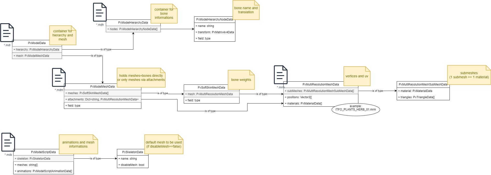

## Software Architecture


* Creator - Creator handles creation (loading) of objects. (e.g. NpcCreator, VobCreator)
* Manager - Manager handle changes on objects at runtime (e.g. WayNetManager to find WayPoint/FreePoint based on Vector3 position or NpcManager to handle Daedalus calls for checking inventory items)
* Properties - Attached to Prefabs. They will store all properties needed for an object. (e.g. NpcProperties, SpotProperties)

### AI handling

Ai consists of two elements:
1. Control logic flow - External functions are executed immediately. (e.g. AI_SetWalkmode(), Wld_IsMobAvailable())
2. Execute an animation - These animations will be put into an ActionQueue and will be executed sequentially. (e.g. AI_GotoWP(), AI_UseMob(), AI_Wait())

```c++
func void ZS_WalkAround	()
{
	AI_SetWalkmode (self,NPC_WALK);  // Execute immediately while parsing

	if (Wld_IsMobAvailable (self,"BED")) // Immediately
	{
        AI_GotoWP (self,self.wp); // QueueAction - Put into Queue and execute sequentially
        AI_AlignToWP (self); // QueueAction
	    AI_UseMob		(self,	"BED",1); 
	}
	
	AI_Wait				(self, 1); // QueueAction
};
```

QueueActions (animations) can become quite complex (e.g. AI_UseMob() requires 1/ turning to Mob, 2/ walking to Mob, 3/ executing animation on mob).
We therefore put them into Command pattern ([wiki](https://en.wikipedia.org/wiki/Command_pattern)).
It means, that every QueueAction handles it's state on it's own and tells the Queue owner, when it's done and another Action can be triggered.


More information about AnimationQueue mechanism at [ataulien/Inside-Gothic - Action-Queue](https://ataulien.github.io/Inside-Gothic/ActionQueue/)


## Gothic assets loading

We fully rely on phoenix and phoenix-shared-interface to import gothic assets. To consume data within Unity (C#) we leverage phoenix-csharp-interface as C -> C# interface.

### Interface information

* Interface classes are alle prefixed >Px<.(e.g. PxModelHierarchy)
* Returned data classes are additionally suffixed with >Data<. (e.g. PxModelHierarchyData)

### Asset information

#### Meshes

Visible assets are called meshes. There are multiple ways from Gothic data to print them on screen.

If you have a name of an object (e.g. HUM_BODY_NAKED0 or CHESTBIG_OCCHESTLARGE) you should try to load it's mesh files in the following order.
1. .mds -> PxModelScriptData - Contains animation and mesh information for animated objects.
2. .mdl -> PxModelData - Consists of .mdh and .mdm information.
3. .mdh -> PxModelHierarchyData - Contains bone informations for meshes.
4. .mdm -> PxModelMeshData - Contains mesh (and optional bone informations)
5. .mrm -> PxMultiResolutionMeshData - Contains the actual mesh render information.

The named files are tightly coupled within phoenix. With this correlation:




---

## Scene loading

We work with async-await for scene loading. It provides us a way to skip frames after x amount of WorldMeshes or VobItems being created.

Hint: async is _*not!*_ async. The way we use it, it's nearly the same as Coroutine. i.e. we just define synchronously when to skip to the next frame.


