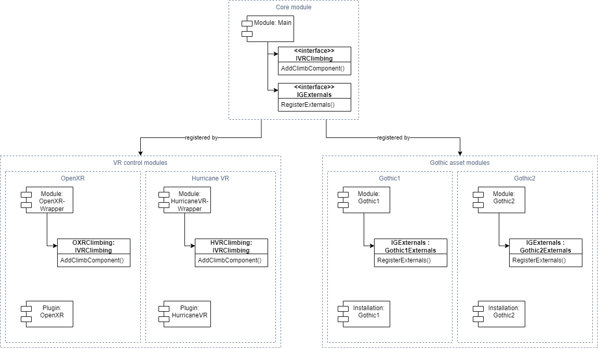

## Software Architecture


* Creator - Creator handles creation (loading) of objects. (e.g. NpcCreator, VobCreator)
* Manager - Manager handle changes on objects at runtime (e.g. WayNetManager to find WayPoint/FreePoint based on Vector3 position or NpcManager to handle Daedalus calls for checking inventory items)
* Properties - Attached to Prefabs. They will store all properties needed for an object. (e.g. NpcProperties, SpotProperties)

### AI handling

Ai consists of two elements:
1. Control logic flow - External functions are executed immediately. (e.g. AI_SetWalkmode(), Wld_IsMobAvailable())
2. Execute an animation - These animations will be put into an ActionQueue and will be executed sequentially. (e.g. AI_GotoWP(), AI_UseMob(), AI_Wait())

```c++
func void ZS_WalkAround	()
{
    AI_SetWalkmode (self,NPC_WALK);  // Execute immediately while parsing
    if (Wld_IsMobAvailable (self,"BED")) // Immediately
    {
        AI_GotoWP (self,self.wp); // QueueAction - Put into Queue and execute sequentially
        AI_AlignToWP (self); // QueueAction
        AI_UseMob (self,	"BED",1); 
    }

    AI_Wait (self, 1); // QueueAction
};
```

QueueActions (animations) can become quite complex (e.g. AI_UseMob() requires 1/ turning to Mob, 2/ walking to Mob, 3/ executing animation on mob).
We therefore put them into Command pattern ([wiki](https://en.wikipedia.org/wiki/Command_pattern)).
It means, that every QueueAction handles it's state on it's own and tells the Queue owner, when it's done and another Action can be triggered.


More information about AnimationQueue mechanism at [ataulien/Inside-Gothic - Action-Queue](https://ataulien.github.io/Inside-Gothic/ActionQueue/)

### Root motion handling

Gothic delivers root motions via BIP01 bone. We use this information to leverage
physics based walking.

It includes:
1. BIP01 and sub-bones will be handled by Animation component
2. Inside BIP01 is a Collider/Rigidbody element, which walks with the animation, but physics based (as not directly handled via animation)
3. This Rigidbody's physics based movement (e.g. grounding) is copied to root (on top of BIP01) to provide this change to the whole animated object
4. In the end, the full BIP01 root motion is copied to root, to ensure the animated object isn't snapping back to 0.


**Root motion corrections:**
Gothic animations don't necessarily start at BIP01=(0,0,0)
Therefore we need to calculate the offset. I.e. first frame's BIP01 is handled as (0,0,0) and followings will be subtracted with it.
(Otherwise e.g. walking will hick up as NPC will _spawn_ slightly in front of last animation loop.)

## Gothic assets loading

We fully rely on ZenKit to import gothic assets. To consume data within Unity (C#) we leverage ZenKitCS as C -> C# interface.

### Asset information

#### Meshes

Visible assets are called meshes. There are multiple ways from Gothic data to print them on screen.

If you have a name of an object (e.g. HUM_BODY_NAKED0 or CHESTBIG_OCCHESTLARGE) you should try to load it's mesh files in the following order.
1. .mds -> IModelScript - Contains animation and mesh information for animated objects.
2. .mdl -> IModel - Consists of .mdh and .mdm information.
3. .mdh -> IModelHierarchy - Contains bone informations for meshes.
4. .mdm -> IModelMesh - Contains mesh (and optional bone informations)
5. .mrm -> IMultiResolutionMesh - Contains the actual mesh render information.

The named files are tightly coupled within ZenKit. With this correlation:


---

## Scene loading

We work with async-await for scene loading. It provides us a way to skip frames after x amount of WorldMeshes or VobItems being created.

Hint: async is _*not!*_ async as another thread. The way we use it, it's nearly the same as Coroutine. i.e. we just define synchronously when to skip to the next frame.


## Modularization concept

As our solution grows, we need a way to properly modularize it and ensure different flavors of solutions (OXR vs HVr, G1 vs G2) can be used at runtime.



GothicVR features the following modules:
* Core module:
  * GothicVR (namespace: GVR) - Core module handling main game logic
* VR control modules
  * OpenXR (namespace: OXR) - Handling legacy OpenXR implementation of VR controls
  * Hurricane VR (namespace: HVR) - Handling Hurricane VR logic for VR controls
* Gothic asset modules (used at a future state)
  * Gothic1 (namespace: G1) - Handling logic specifically designed to work with Gothic1 only
  * Gothic2 (namespace: G2) - Handling logic specifically designed to work with Gothic2 only


To ensure we can load the neccessary data at runtime only, we leverage Dependency Injection framework
[Extenject](https://github.com/Mathijs-Bakker/Extenject) (successor of Zenject).

An example implementation looks like this:

**Registering DI Installers**  
```c#
private static readonly List<string> INSTALLERS = new() {
    "GVR.OXR.OXRInstaller",
    "GVR.HVR.HVRInstaller",
    "GVR.G1.G1Installer",
    "GVR.G2.G2Installer"    
};

private void Awake()
{
    var installers = new List<MonoInstaller>();

    foreach (var installer in INSTALLERS)
    {
        var type = Type.GetType(installer);

        // Is the module installed? If not, skip it.
        if (type == null)
            continue;

        var component = (MonoInstaller)gameObject.AddComponent(type);
        installers.Add(component);
    }

    // Dynamically set Installers of each found module to set up their injections.
    GetComponent<SceneContext>().Installers = installers;
}
```

**Example DI Installer - HVR**  
```c#
using Zenject;

namespace GVR.ZenjectTest.HVR
{
    public class HVRInstaller : MonoInstaller
    {
        public override void InstallBindings()
        {
            Container.Bind<IDemoInjectable>().To<HVRDemoInjectable>().AsSingle();
        }
    }
}

```

**Example DI Installer - OXR**  
```c#
using Zenject;

namespace GVR.OXR
{
    public class OXRInstaller : MonoInstaller
    {
        private const string HVR_BOOTSTRAPPER = "GVR.HVR.HVRInstaller";

        public override void InstallBindings()
        {
            // Cross-check, if HVR is set up, then don't set up legacy OXR plugin.
            if (Type.GetType(HVR_BOOTSTRAPPER) != null)
                return;

            Container.Bind<IDemoInjectable>().To<OXRDemoInjectable>().AsSingle();
        }
    }
}
```

**Use injection at runtime**  
```c#
public class Demo
{
    // Will be either OXRDemoInjectable or HVRDemoInjectable
    [Inject]
    IDemoInjectable demoInjectable;
}
```

### VR Controls modules

Initially we leveraged OpenXR directly to implement VR controls. After research, we decided to go with Hurricane VR as
it offers feature rich out-of-the-box capabilities for VR controls. Nevertheless, the module is paid and we need to ensure,
that developers who want to work on the project, but don't owning the asset, are able to develop the game. Therefore we
offer the multi-module approach.

At runtime, our game decides whether to load the legacy OXR implementation to ensure developers can start the game.

Use cases:
* A developer doesn't own Hurricane VR and wants to import ZenKit data - Uses OpenXR module
* A developer owns Hurricane VR and wants to work on VR controls - Uses Hurricane VR module
* A developer owns Hurricane VR but doesn't want to change VR controls (e.g. importing new ZenKit assets) - Also uses Hurricane VR for running the game

#### How to ensure HVR is not referenced in code if not bought

The image above shows, that there are two major elements required, when using Hurricane VR:
1. Hurricane VR Plugin is installed on local Unity project
2. Hurricane VR wrapper module is installed on local Unity project

To ensure we have no code reference towards an HurricaneVR namespace, we will:
1. The wrapper plugin is a separate GitHub repository, which we reference as a .gitmodule
2. Hurricane VR will be .gitignore'd and never committed to the main repository

**Workflow for non Hurricane VR developers:**
1. Checkout GothicVR repository (without git submodule for HVR wrapper)
2. Build and play  
   --> This solution will automatically use OpenXR plugin as fallback as the HVR Installer isn't present.

**Workflow for Hurricane VR developers:**
1. Checkout GothicVR repository
2. Checkout git submodule for HVR wrapper
3. Put Hurricane VR installation into local project
4. Build and play  
   --> Once setup, GVR will automatically pick HVR as current implementation of VR Controls


### Gothic asset modules (TBD)

Once we finished developing GothicVR for Gothic1, we will move on implementing Gothic2 specifics. The modularization concept
can help clearly separating code used by either of these games.


### Future modules (TBD)

Depending on our development progress, we might decide to go on with supporting mods which are using DLL exploits (Ninja etc.) or
other implementing other features like Multiplayer, then we can reuse the module logic by implementing only, what's needed at runtime.
