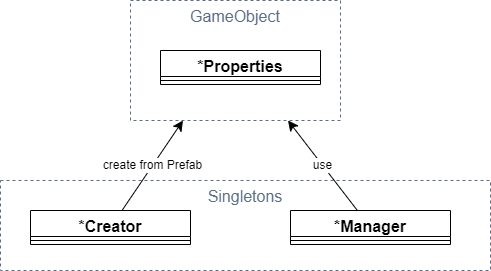

## Software Architecture



* Creator - Creator handles creation (loading) of objects. (e.g. NpcCreator, VobCreator)
* Manager - Manager handle changes on objects at runtime (e.g. WayNetManager to find WayPoint/FreePoint based on Vector3 position or NpcManager to handle Daedalus calls for checking inventory items)
* Properties - Attached to Prefabs. They will store all properties needed for an object. (e.g. NpcProperties, SpotProperties)

### AI handling

Ai consists of two elements:
1. Control logic flow - External functions are executed immediately. (e.g. AI_SetWalkmode(), Wld_IsMobAvailable())
2. Execute an animation - These animations will be put into an ActionQueue and will be executed sequentially. (e.g. AI_GotoWP(), AI_UseMob(), AI_Wait())

```c++
func void ZS_WalkAround	()
{
    AI_SetWalkmode (self,NPC_WALK);  // Execute immediately while parsing
    if (Wld_IsMobAvailable (self,"BED")) // Immediately
    {
        AI_GotoWP (self,self.wp); // QueueAction - Put into Queue and execute sequentially
        AI_AlignToWP (self); // QueueAction
        AI_UseMob (self,	"BED",1); 
    }

    AI_Wait (self, 1); // QueueAction
};
```

QueueActions (animations) can become quite complex (e.g. AI_UseMob() requires 1/ turning to Mob, 2/ walking to Mob, 3/ executing animation on mob).
We therefore put them into Command pattern ([wiki](https://en.wikipedia.org/wiki/Command_pattern)).
It means, that every QueueAction handles it's state on it's own and tells the Queue owner, when it's done and another Action can be triggered.


More information about AnimationQueue mechanism at [ataulien/Inside-Gothic - Action-Queue](https://ataulien.github.io/Inside-Gothic/ActionQueue/)

### Root motion handling

Gothic delivers root motions via BIP01 bone. We use this information to leverage
physics based walking.

It includes:
1. BIP01 and sub-bones will be handled by Animation component
2. Inside BIP01 is a Collider/Rigidbody element, which walks with the animation, but physics based (as not directly handled via animation)
3. This Rigidbody's physics based movement (e.g. grounding) is copied to root (on top of BIP01) to provide this change to the whole animated object
4. In the end, the full BIP01 root motion is copied to root, to ensure the animated object isn't snapping back to 0.


**Root motion corrections:**
Gothic animations don't necessarily start at BIP01=(0,0,0)
Therefore we need to calculate the offset. I.e. first frame's BIP01 is handled as (0,0,0) and followings will be subtracted with it.
(Otherwise e.g. walking will hick up as NPC will _spawn_ slightly in front of last animation loop.)

## Gothic assets loading

We fully rely on ZenKit to import gothic assets. To consume data within Unity (C#) we leverage ZenKitCS as C -> C# interface.

### Asset information

#### Meshes

Visible assets are called meshes. There are multiple ways from Gothic data to print them on screen.

If you have a name of an object (e.g. HUM_BODY_NAKED0 or CHESTBIG_OCCHESTLARGE) you should try to load it's mesh files in the following order.
1. .mds -> IModelScript - Contains animation and mesh information for animated objects.
2. .mdl -> IModel - Consists of .mdh and .mdm information.
3. .mdh -> IModelHierarchy - Contains bone informations for meshes.
4. .mdm -> IModelMesh - Contains mesh (and optional bone informations)
5. .mrm -> IMultiResolutionMesh - Contains the actual mesh render information.

The named files are tightly coupled within ZenKit. With this correlation:


---

## Scene loading

We work with async-await for scene loading. It provides us a way to skip frames after x amount of WorldMeshes or VobItems being created.

Hint: async is _*not!*_ async as another thread. The way we use it, it's nearly the same as Coroutine. i.e. we just define synchronously when to skip to the next frame.


