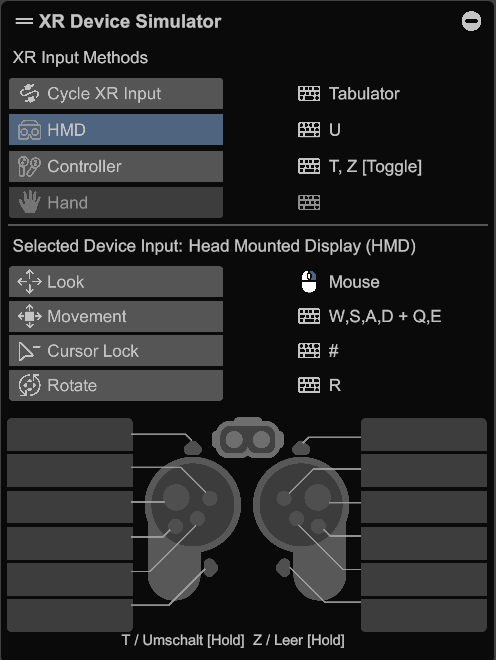
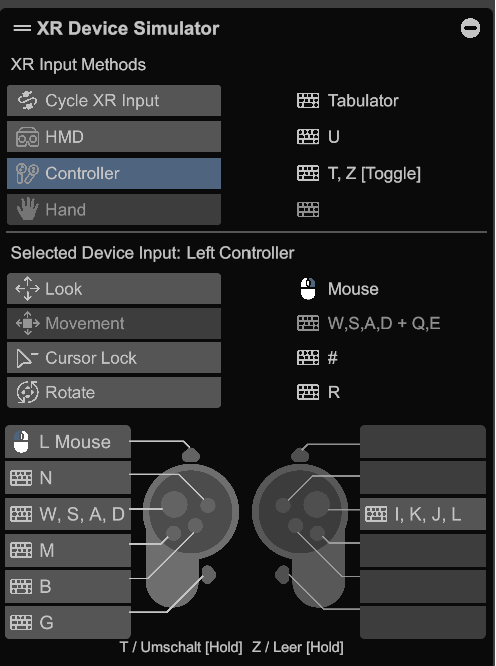
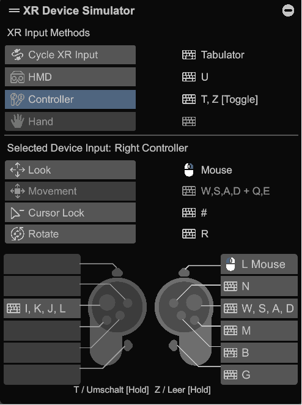

## Unity setup hints
* For local Gothic installation directory, please create file _GameSettings.dev.json_ next inside _Assets/StreamingAssets_. This file is ignored by git and you need to set its values to make the game run in Unity.
* Load scene "Bootstrap" in your Editor. Hit play and you're good to go.
* You can (de)activate features with the Component "FeatureFlags". It changes features at Editor time and won't change elements during runtime. (change values first, hit play second).

## FeatureFlags
* Can be found at _Assets/GothicVR/Scripts/Debugging/FeatureFlag.cs_
* FeatureFlags can be reset to a production ready state (e.g. deactivate WIP features and only activate finalized ones).  
* Use _Unity Menu --> GothicVR --> Tools --> FeatureFlags - Set Production ready state_
* While building a release, this method will be automatically called to ensure a production ready state.

**Hints for creating new FeatureFlags**:
* If you create a new FeatureFlag to toggle a functionality, ensure the default value is always false as we reset the value to false before releasing (e.g. bool:enableVobs).
* If you want to have your Flag set for production, go to _Assets/GothicVR/Editor/Tools/FeatureFlagTool.cs_ and add your element inside _ProductionFlags_

This example activates (```=true```) a flag (```createVobs```) when menu button _FeatureFlags - Set Production ready state_ is called:
```c#
private static readonly List<Tuple<string, Type, object>> ProductionFlags = new()
{
    new(nameof(FeatureFlags.createVobs), typeof(bool), true),
}
```

## Updating Unity or packages

**Updating _XR Interaction Toolkit_**  
_XRI Default Input Actions.inputactions_ are put from the Samples folder into _Assets/GothicVR/XR Interaction Toolkit/_.
This ensures (e.g.) velocity handling for Climbing ladders persists after updates. Nevertheless, after an update, it needs to be rechecked.

Update hints from Unity: [Starter Assets](https://docs.unity3d.com/Packages/com.unity.xr.interaction.toolkit@2.5/manual/samples-starter-assets.html)


## XRDeviceSimulator
You can play the game with [OpenXR's control simulator](https://docs.unity3d.com/Packages/com.unity.xr.interaction.toolkit@2.4/manual/xr-device-simulator-overview.html).
This enables you to test without setting up your HMD.
It needs to be activated via FeatureFlag _UseXRDeviceSimulator_ and is implemented to run in Editor mode only.

We're using the default controls which are:

**HMD (No specific controller activated)**  


**Left controller**  


**Right controller**  

