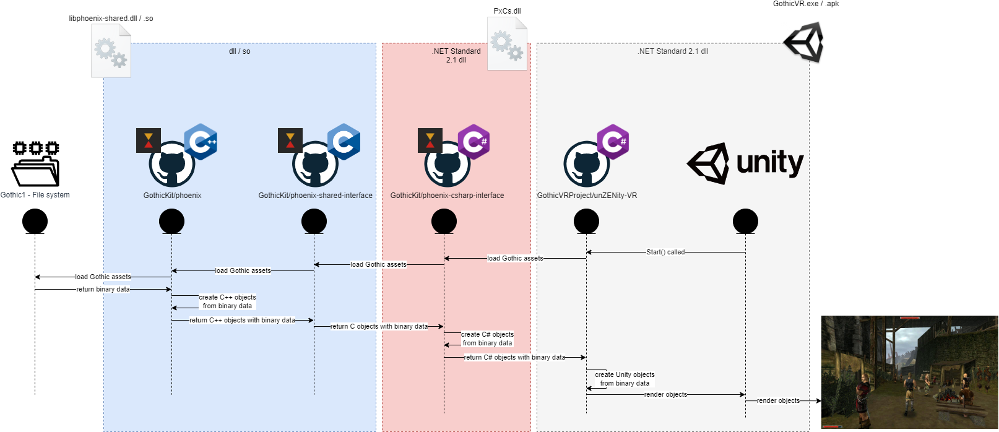

# unZENity-VR
This repository aims to leverage Unity as Open Source VR solution to work with Gothic 1/2, Mods, and Total Conversions.

It's a PoC if the idea of _Importing everything_ from Gothic and act as the new engine (ZenGine --> Unity) behind the scenes can work.

Heavily inspired and reusing code from:
* [phoenix](https://github.com/lmichaelis/phoenix) - Gothic1/2 asset reading and parsing framework
  * which is re-using [ZenLib](https://github.com/ataulien/ZenLib)
  * and is implemented in [OpenGothic](https://github.com/Try/OpenGothic)

## How to contribute
We're always looking for people with knowledge and/or spirit. Feel free to reach out to us via gothicVR(at)outlook.com or visit us at our Discord server [Gothic VR](https://discord.gg/3EzACMVx).

## Workflow/Gameflow

1. unZENity-VR requests data from PxCs.dll (.net standard 2.1 shared library which is cross-OS compatibel)
1. The dll itself forwards request to libphoenix-shared.dll/.so as it includes the original phoenix parser library.
1. phoenix-shared-interface loads the file system data.
1. The data is then returned to Unity to build Unity C# objects like Meshes.

## Dependencies
unZENity-VR is using the following projects:
* [phoenix](https://github.com/GothicKit/phoenix) (Gothic asset parser)
* [phoenix-shared-interface](https://github.com/GothicKit/phoenix-shared-interface) (C++ -> C interface)
* [phoenix-csharp-interface](https://github.com/GothicKit/phoenix-csharp-interface) (C# endpoint for C interface)

# Usage

# Gamers
*  PCVR - To set folder for Gothic 1 set its location at ./StreamingAssets/GameSettings.json
*  Quest2/PicoVR - copy the game files inside of Android/data/com.DefaultCompany.unZENity-VR/files

## Developers
* To set folder for Gothic 1 set its location inside Unity development space at ./Assets/StreamingAssets/GameSettings.dev.json (you need to create this file as it's added to .gitignore)

## FAQ

**Q: Why do you use an external framework to parse Gothic assets?**  
A: phoenix is a full Gothic asset parser and already used by OpenGothic which is feature complete to work with Gothic1, Gothic2, and Gothic2 the Night of the Raven. Why reinventing the wheel? ¯\_(ツ)_/¯

**Q: Why do you use integrate phoenix as shared library (DLL)?**  
A: As phoenix is written in C++, we need a way to communicate with C#. The way to go is shared libraries as they can be used within C# via _DllImport_.

**Q: What an interesting project name...**  
A: True! It's a combination of Gothic, Unity, Zen, VR, and a grain of insanity ;-)
