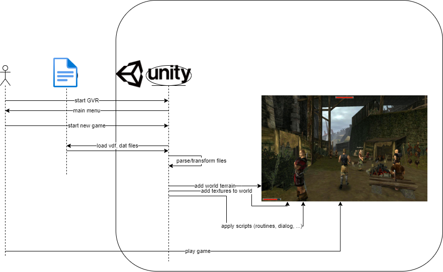

# unZENity-VR
This repository aims to leverage Unity as Open Source VR solution to work with Gothic 1/2, Mods, and Total Conversions.

It's a PoC if the idea of _Importing everything_ from Gothic and act as the new engine (ZenGine --> Unity) behind the scenes can work.

Heavily inspired and reusing code from:
* [REGoth-bs](https://github.com/REGoth-project/REGoth-bs) ([Documentation](https://regoth-project.github.io/REGoth-bs/index.html))
* [OpenGothic](https://github.com/Try/OpenGothic)


## Gothic folder and files to import

Relevant Gothic folder and included files:
```
/_work/DATA
  /Music/* --> .sgt, .sty, .dls
  /PRESETS --> .zen
  /scripts --> .dat
/Data      --> .vdf
```

File types and including data:
| File | Information |
|-|-|
| .vdf | Compiled files. Can include everything like world meshes and wav. |
| .dat | Compiled .d (Daedalus) scripts. |
| .zen | World files with Waypoints and VOB (virtual object) placements. |
| .sgt/.sty/.dls | Something related to audio... ¯\_(ツ)_/¯ |


## Workflow/Gameflow



## Gothic file formats and how to use

### Mesh
* Meshes are inside .vdf (worlds.vdf) --> .zen
* Meshes can be in 3 variants: ASCII|BINARY|BIN_SAFE
* Gothic meshes includes at least vertices
* Need to check if we need to convert them to a 3ds/fbx file or just load directly from ZEN when game starts
* C# parser is a reimplementation of [ataulien/ZenLib](https://github.com/ataulien/ZenLib/) and [lmichaelis/phoenix](https://github.com/lmichaelis/phoenix)


## What and how to use

### World meshes
1. (manually done) Extract VDF (e.g. worlds.vdf) into .zen (ZenLib)
2. (todo) Convert .zen into .3ds (e.g. oldcamp.3ds) (which tool?)
3. (done) Import oldcamp.3ds into Unity
4. (manually done) Extract VDF (e.g. texture.vdf) into zen (ZenLib --> @see samples/vdf_unpack.cpp)
5. (todo) Convert .tex textures into .tga (which tool?)
6. (done) While creating mesh->materials we need to reference the TGA files in Unity

Hints:
* .tex -> Enthält eine Textur samt MipMap (Standard-Format: DXTC/S3TC)

## lib/ZenLib

**install**  
```powershell
choco install cmake --installargs 'ADD_CMAKE_TO_PATH=System'
choco install mingw
```

**build**  
```powershell
mkdir build
cd build
cmake -G "MinGW Makefiles" -D ZENLIB_BUILD_EXAMPLES=On ..
cmake --build .
```

**samples**  
```powershell
cd build/samples
mkdir vdf-test

# Will extract ZEN files out of VDFS
./vdf_unpack.exe "C:\Program Files (x86)\Steam\steamapps\common\Gothic\Data\worlds.vdf" ./vdf-test
```

```powershell
cd build/samples

# Extracts VOB entries (e.g. Waypoints) from ZEN file (Like Spacer is doing)
./zen_load.exe "C:\Program Files (x86)\Steam\steamapps\common\Gothic\Data\worlds.vdf" "world.zen"

```


## Howto load worldmesh
* Check 
  * ImportStaticMesh.cpp/BsZenLib::ImportAndCacheStaticMesh()
  * ImportStaticMesh.cpp/BsZenLib::ImportAndCacheStaticMeshGeometry()
  * zCProgMeshProto.h/ZenLoad::zCProgMeshProto()

--> parser.readWorldMesh() --> during reading of .zen file it will parse mesh into this object.

## FAQ

**Q: What an awkward name...**  
A: True! It's a combination of Gothic, Unity, Zen, VR, and a grain of insanity.

**Q: Why did you reimplement parsing of Gothic files as ZenLib and phoenix already did it?**  
A: Unfortunately we couldn't get ZenLib to compile as shared Library/DLL (compile error as dependencies weren't prepared for SHARED usage) and phoenix isn't exporting it's functions as extern "C" which is [required by mono](https://www.mono-project.com/docs/advanced/pinvoke/) (Unity crashes without error message when calling phoenix's functions via DLLImport).