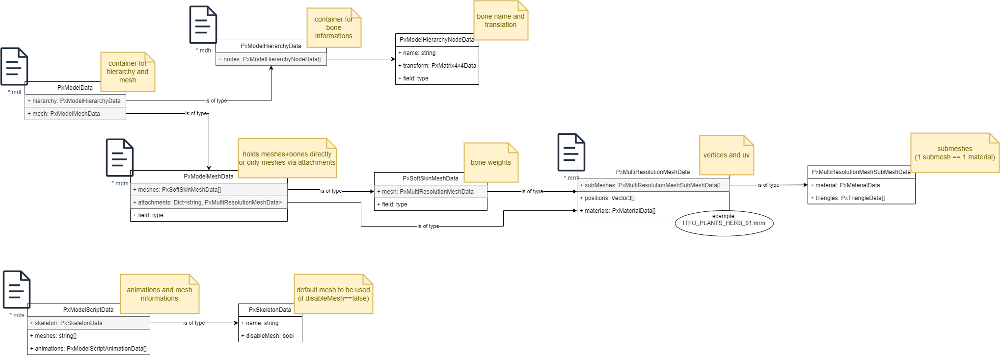
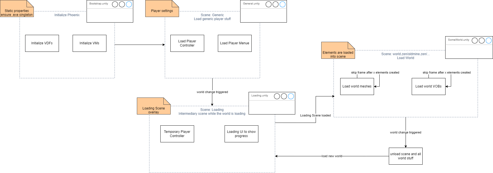

## Gothic assets loading

We fully rely on phoenix and phoenix-shared-interface to import gothic assets. To consume data within Unity (C#) we leverage phoenix-csharp-interface as C -> C# interface.

### Interface information

* Interface classes are alle prefixed >Px<.(e.g. PxModelHierarchy)
* Returned data classes are additionally suffixed with >Data<. (e.g. PxModelHierarchyData)

### Asset information

#### Meshes

Visible assets are called meshes. There are multiple ways from Gothic data to print them on screen.

If you have a name of an object (e.g. HUM_BODY_NAKED0 or CHESTBIG_OCCHESTLARGE) you should try to load it's mesh files in the following order.
1. .mds -> PxModelScriptData - Contains animation and mesh information for animated objects.
2. .mdl -> PxModelData - Consists of .mdh and .mdm information.
3. .mdh -> PxModelHierarchyData - Contains bone informations for meshes.
4. .mdm -> PxModelMeshData - Contains mesh (and optional bone informations)
5. .mrm -> PxMultiResolutionMeshData - Contains the actual mesh render information.

The named files are tightly coupled within phoenix. With this correlation:

---

## Scene loading

We work with async-await for scene loading. It provides us a way to skip frames after x amount of WorldMeshes or VobItems being created.

Hint: async is _*not!*_ async. The way we use it, it's nearly the same as Coroutine. i.e. we just define synchronously when to skip to the next frame.

